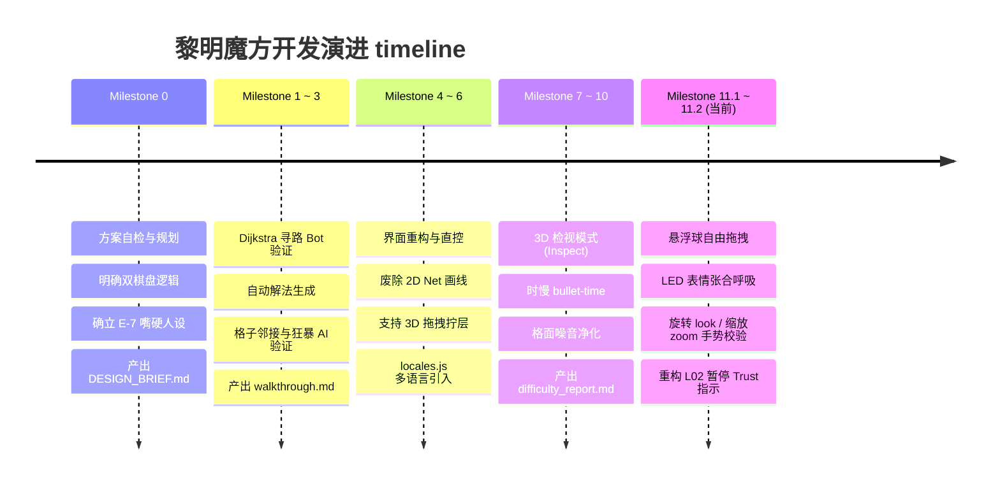

# 《黎明魔方》文档导航与版本索引门户 (Project Documentation Portal)

> 本文档将《黎明魔方 / DAWN CUBE》项目中所有**非代码类文稿文件**（设计蓝图、沟通看板、测试报告、开发历史等）按照国际先进的 **Diátaxis 架构**进行分类整理，并**在每个文件内部和总表中明确划分了版本与里程碑（Milestones）信息**，使得即使是不了解此游戏的外部人员也能一眼看懂并精准查阅。

---

## 🗺️ 一、Diátaxis 文档四象限分类与相对路径链接

### 1. 📖 教学与上手 (Tutorials)
*帮助新加入的人快速熟悉开发环境和基础命令，强调“学习”。*

*   **[CLAUDE.md](CLAUDE.md)**
    *   **定位**：开发与测试上手命令手册。
    *   **版本划分**：伴随 `Milestone 0` 建立，在 `Milestone 8~10` 时追加了关于 A* 求解器的验证命令，在 `Milestone 11` 追加了本地 HTTP 服务的拉起方法。
    *   **核心内容**：说明如何运行代码检查、如何本地跑验证、以及代码风格与 AI 安全写码规范。

---

### 2. 🗂️ 操作指南 (How-to Guides)
*引导用户解决特定的实际问题或完成某项特定任务，强调“解决问题”。*

*   **[walkthrough.md](walkthrough.md)**
    *   **定位**：通关方案步骤图谱。
    *   **版本划分**：在 `Milestone 3` 时首次由寻路 Bot 跑出并归档，历经 `Milestone 6`（实时模式）与 `Milestone 11.2`（L07 双碎解关重构、L02 暂停引导）两次大规模数据重算与修正。
    *   **核心内容**：L01~L40 全关卡的可解性验证数据与 Bot 黄金通关步骤（如 `move U3-2>F1-2`）。
*   **[handover_report.md](handover_report.md)**
    *   **定位**：智能体托管开发完毕后的交接汇报。
    *   **版本划分**：属于 `Milestone 11` 最终成果物，记录了当前版本的残留限制。
    *   **核心内容**：列出开发完毕后建议 CEO（您）优先人工试玩的关卡（如 L07、L10 碎解关）和视觉验证指引。

---

### 3. 🔍 技术参考 (Reference)
*提供客观、无偏见的系统数据与接口字典，强调“查阅事实”。*

*   **[levels.js](../levels.js) (文案与格子数据)**
    *   **定位**：全关卡数据字典与新手引导数据定义。
    *   **版本划分**：
        *   `M1`：定义基础 3D 坐标；
        *   `M7`：加入 Interactive 强引导状态机；
        *   `M11.2`（当前）：重构 L02，废除重复的行走 move 指令，改成 Esc 与 Trust 科普。
    *   **核心内容**：L01~L40 的网格尺寸、钥匙、逃生门坐标、AI 怪物类型与动作约束数据。
*   **[locales.js](../locales.js) (多语言)**
    *   **定位**：UI 静态词条翻译库。
    *   **版本划分**：在 `Milestone 4.7 (v2.0)` 引入，在 `Milestone 10` 对 meta 和 Twist 按钮词条进行了丰富。
    *   **核心内容**：中英文双语对照的菜单按钮、成就面板、规则简介等 DOM 文本。
*   **[difficulty_report.md](difficulty_report.md)**
    *   **定位**：心流曲线与难度斜率数据报告。
    *   **版本划分**：随着 `Milestone 9` 审计工具化自动跑出，反映当前版本的关卡结构。
    *   **核心内容**：汇总每关的回合数、首发机制，警告 L31-L33 短关簇等节奏风险。
*   **[level_quality_report.md](level_quality_report.md)**
    *   **定位**：关卡硬性硬性硬约束指标清单。
    *   **版本划分**：伴随 `Milestone 9` 与 `Milestone 11.2` 的求解器升级而更新。
    *   **核心内容**：验证每关是否包含捷径、AP 限制是否过软、以及是否使用对应工具。

---

### 4. 💡 背景与原委 (Explanation)
*解释项目架构的“为什么”、决策记录与交流日志，强调“理解”。*

*   **[DESIGN_BRIEF.md](DESIGN_BRIEF.md)**
    *   **定位**：项目系统架构设计白皮书。
    *   **版本划分**：CEO 在 `Milestone 0` 锁死的第一版，为后续所有 Milestone 的功能开发提供了物理面坐标反推、AP 扣减及反转剧情依据。
    *   **核心内容**：详述 3D 摄像机飞越的数学逻辑、E-7 嘴硬心软情绪交互的设计细节。
*   **[COMMUNICATION_BOARD.md](COMMUNICATION_BOARD.md)**
    *   **定位**：Antigravity (Mastermind) 与 Codex (Claude Code) 协同留言板。
    *   **版本划分**：横跨 `Milestone 0` 至 `Milestone 11`，忠实归档了 Dawn 更名 E-7 审批、第三幕选定“单向传送门”决策等 CEO 审批决议。
    *   **核心内容**：开发过程中的红线意见、QA 反馈、智能体自查问题列表。
*   **[task.md](task.md)**
    *   **定位**：开发历史主线 TODO 进度总看板。
    *   **版本划分**：从 `M0` 基础探讨，直到当前 `M11.2` 阶段，按里程碑层层划分，条理清晰。
    *   **核心内容**：记录每一代智能体在该项目下的工作成果与尚未交付的悬挂任务。
*   **[implementation_plan.md](implementation_plan.md)**
    *   **定位**：当前 Milestone 11 的物理实施草案与 CEO 确认细节。
    *   **版本划分**：对应 `Milestone 11` 及后续细节调整（当前活跃）。
    *   **核心内容**：定义拖动球隔离、LED 面部抖动、Look/Zoom 手势进度的算法逻辑。
*   **[agents_hub/PROJECT_CEO_INSTRUCTIONS.md](agents_hub/PROJECT_CEO_INSTRUCTIONS.md)**
    *   **定位**：CEO 为智能体网络订立的行为规范指南。

---

## 📈 二、核心开发里程碑（Milestone Versions）演进轴

为了避免混淆，不了解此游戏的审核者可以通过以下**时间/里程碑对照表**，快速理清项目是如何一步步演进到当前状态的：

### 里程碑版本演进详细内容说明：

1.  **【方案与规划期】Milestone 0** (v0.1)
    *   **主攻方向**：技术栈自检、3x3 空间邻接算法讨论。
    *   **关键交付物**：[DESIGN_BRIEF.md](DESIGN_BRIEF.md) 对话模板、心流表。
2.  **【双棋盘与核心机制期】Milestone 1 ~ 3** (v0.5 ~ v1.0)
    *   **主攻方向**：Chaser 追猎、Guardian 狂暴、A* 求解器开发、地表回溯 Undo 悔棋。
    *   **关键交付物**：[walkthrough.md](walkthrough.md) 解路快照、[CLAUDE.md](CLAUDE.md) 校验规则。
3.  **【手感抛光与手机重构期】Milestone 4 ~ 6** (v1.5 ~ v2.2)
    *   **主攻方向**：3D 面板拖拽拧层（Twist）、主动碎解格子机制（Break）、E-7 关系信任系统引入。
    *   **关键交付物**：[locales.js](../locales.js) 静态词典。
4.  **【时慢与大厅优化期】Milestone 7 ~ 10** (v2.3 ~ v2.5)
    *   **主攻方向**：3D 自转战术检视（Inspect）、5 倍慢速子弹时间（Bullet Time）、Esc 面板分流。
    *   **关键交付物**：[difficulty_report.md](difficulty_report.md) 统计表。
5.  **【交互解耦与细节打磨期】Milestone 11.1 ~ 11.2 (当前版本)** (v2.6 ~ v3.0)
    *   **主攻方向**：物理手势 Look & Zoom 真实移动判定、Esc 面板 Trust 指标高亮、Comms/Tools 球自由拖拽。
    *   **关键交付物**：[implementation_plan.md](implementation_plan.md) 规划、[handover_report.md](handover_report.md) 手工测试推荐。
