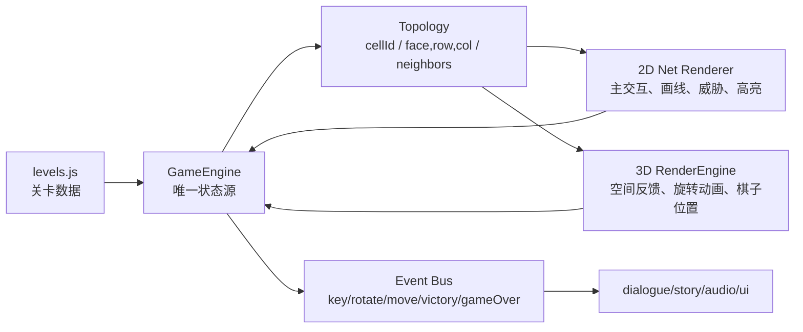

# 🎬 Milestone 11: Decoupled Tutorial System, Draggable Bubbles, and Inspect-Scanner (2026-06-28)

> 状态：`[STATUS: AUDIT_PASSED]`
> 执行者：主管智能体 (Antigravity / 人工精修)
> 红线：彻底隔离操作与语言，废除天书学术词汇，对白降权只渲染情绪；实装自由拖拽/防误触/默认闭合的聊天球与工具球；第一关视角强制拖拽手势与进度条联动；第二关高亮通话、Trust与Esc科普；L06黄怪、L07碎解、L13补片等教学套用新标；残局卡册开发Hover精美悬浮扫描框（新机制/怪数/简介）。

- [x] **M11.1 自由拖拽悬浮聊天球与工具箱球实装 (`index.html` & `style.css` & `main.js`)**
  - [x] 平时隐藏臃肿侧边栏，右下角仅悬浮两颗带霓虹发光外圈的圆形球（Comms 球与 Toolbox 球），默认关闭状态。
  - [x] 使用 `mousedown/mousemove/mouseup`（及触屏事件）绑定悬浮球，支持屏幕范围内玩家自由拖动。
  - [x] 隔离拖动与点击动作：判定指针抬起时的位移差值。大于 5px 仅更新坐标，小于 5px 触发点击平滑滑入/滑出。
  - [x] 在新手教学对应步骤时，两颗球能跟随教学指示自动弹出，不产生遮挡死锁。
- [x] **M11.2 动态 LED 点阵表情动画升级 (`main.js` & `style.css`)**
  - [x] 挂载 Canvas 渲染循环：在打字机对话未结束时，嘴巴像素块产生上下张合波形；静止时，每隔 3~5 秒控制眼睛像素闭合 150ms 模拟自然眨眼。
  - [x] 增加 4 秒周期的面部轻微呼吸起伏，并在每一帧对发光模糊（shadow blur）施加 1% 随机抖动模拟 CRT 电压闪烁。
- [x] **M11.3 启发式/操作解耦教程关卡重构 (`render.js` & `style.css` & `levels.js` & `main.js`)**
  - [x] 将 L01, L02, L03, L04, L06, L07, L13, L16, L23 教程对白全面去爹味、人机化。删除一切轴向说明，全部改为动作指引，文字只负责情绪。
  - [x] 具体的移动、旋转、工具步骤由系统 UI 的硬性强约束（限制其余格子交互，亮绿且指向绿箭头）直观驱动，不识字也能过关。
  - [x] **第一关 (L01)**：中央淡入手滑手势动画与圆弧进度条；玩家主动拖动视角累加满 100% 才解锁；镜头飞越聚焦圆门大门并特写，讲解出口大白话。
  - [x] **第二关 (L02)**：开局全暗高亮通话框与 Trust 科普；引导按下 Esc 打开面板查看信任值 (80) 并高亮，关闭后才开打。第一关关闭 Trust 相关提示，第二关去除重复的行走教学。
  - [x] **视角旋转累加检测**：限制仅在 `isPointerDown === true` 且 `!cameraFlight` 时累计 theta/phi 视角旋转差值，防止进关飞越相机将该步骤自动秒过。
- [x] **M11.4 战术检视（Inspect）面板重置为简报扫描室 (`index.html` & `main.js` & `style.css`)**
  - [x] 重构左侧 `#inspect-overlay`，展现“战术简报 (Briefing Log)”剧情世界观与“战场扫描 (Scanner Card)”卡片。
  - [x] 战场扫描直接扫出本关怪物数、钥匙数，对有新机制的物品卡片右上角打上闪烁 `[ ⚠️ NEW 新机制 ]` 荧光红角标。
  - [x] 检视期间，3D 摄像机围绕魔方慢速自转一圈展示背面，点击 `开始行动` 飞入主角近景后，自转停下。
- [x] **M11.5 卡册 Hover 精美浮窗开发 (`style.css` & `main.js`)**
  - [x] 抛弃浏览器 title 小黄条。开发一个带淡入动画的 Hover 浮窗面板。
  - [x] Hover 卡片时，悬浮浮窗展现本关的章节名、怪数统计、新机制荧光角标及轻量剧情简介。

> Git Checkpoint: `227eec2 feat: complete Milestone 11.2 decoupled onboarding, interactive gesture arcs, draggable bubbles, led eye-blinking animation, and scanner briefing log`

---

# 🎬 Milestone 10: Setup Redesign, Esc Console Routing, Viewport Focus, and HUD decluttering (2026-06-27)

> 状态：`[STATUS: AUDIT_PASSED]`
> 执行者：Antigravity (Mastermind)
> 红线：关卡检视文字块移至左上角；初始相机视角与 Viewport 聚焦主角；Esc 键在不同场景下的多级分流；隐藏顶部冗余 HUD 横幅与手机头像占位虚线框；净化残局卡册星图只显示极简编号与 Hover 浮动说明。

- [x] **M10.1 初始镜头对焦主角与检视面板左上角避让 (`render.js` & `style.css`)**
  - [x] 重构 `#canvas-overlay-ui` 的定位，使其撑满 100% 容器，使 `#inspect-overlay` 真正居于屏幕左上角不挡魔方。
  - [x] 动态计算魔方中心到主角物理位置 the normal vector, as camera heading. Set camera initial pos on top-diagonal facing that surface.
  - [x] 重建 `resetCamera`、`flyToGameCamera`、`setGameViewportBias` 的 lookAt 基准点，使它们在游玩期间跟随主角的起始坐标。
- [x] **M10.2 Escape 暂停按键事件状态机分流 (`main.js`)**
  - [x] 在 `main.js` 的按键监听中，拦截 `Escape` 键。如果是设置激活、档案室激活、制作人员激活、选关激活、检视激活，则分别退回各自上一层级，仅在游玩中才开/关暂停控制台。
- [x] **M10.3 移去顶部 HUD 遮挡、头像占位与 title 多语言翻译 (`style.css` & `locales.js` & `main.js`)**
  - [x] 在 `style.css` 中将 `.top-hud` 设置 `display: none !important` 隐藏。
  - [x] 在 `style.css` 中将手机通讯顶部头像框 `.companion-slot` 隐藏并修改 `.companion-dock` 布局。
  - [x] 在 `locales.js` 中新增 meta 按钮和 Twist 按钮 title 翻译词条，并在 `applyLanguage` 里就地替换 title。
- [x] **M10.4 星轨选关卡片极简重设 (`main.js` & `style.css`)**
  - [x] 在 `main.js` 选关卡片渲染中，使用正则/split提取 `L01` / `L02` 代号作为圆形卡片内展示的主文字，并为卡片赋予完整 title 提示。
  - [x] 优化 `.level-card-title` 的字体大小和显示定位。
- [x] **⚠️ Codex 物理写码待办：B面（紫色面）拖拽/旋转轴异常修复**
  - [x] 调试并修复在 B面 (Back 后面 / 紫色面) 时，拖拽或使用 Twist 模式进行某些轴向旋转操作时发生的奇怪锁定/无法拧层的问题。
  - [x] Git Checkpoint：`27efb73 fix(render): stabilize twist drag direction on back face`

---

# 📅 预排期规划：Milestone 11 回合制与实时CD混合机制 (Milestone 11 Spec)

> 状态：`[STATUS: PLANNED]`
> 目标：将前两幕的动作机制彻底划分为“第一幕纯策略回合制”与“第二幕失控实时CD制”，平滑难度心流并强化后期实时紧张感。

### 📋 回合制机制细则 (Act 1: L01 ~ L12)
1. **时钟静止**：`realtimeMode` 在第一幕自动设为 `false`（或实时 ticking 彻底暂停），玩家不做有效行动时，整个世界（所有棋子与危险倒计时）绝对静止，不扣除时间。
2. **行动消耗回合**：
   - 只要玩家执行了任何一个**有效主动操作**（包含：走一格、原地待命、旋转魔方任意层、部署信标/补片、碎解格子等），都视为消耗 **1 回合（1 步）**。
   - 在该有效动作执行完毕的瞬间，驱动场上所有敌人（红棋子、黄棋子）**同步计算并前进一步**。
   - 若玩家点击不可达格子或遭游戏拦截（无效操作），不计入回合，怪物静止。
3. **悔棋联动**：Undo 时所有怪物的物理位置与魔方姿态完全倒退回上一步（Snapshot 回滚）。

### 📋 实时CD机制细则 (Act 2: L13 ~ L40)
1. **实时推进与慢放**：进入第二幕，`realtimeMode` 强制设为 `true`。怪物根据自身 CD（如 2.5 秒）自动推进，按住 Space 的 0.2 倍速慢放机制生效。
2. **主角行动 CD 约束**：
   - 限制主角的 **“位移/走格子”** 行动：每走一格后，主角进入 **0.5 秒** 的冷却 CD（在 CD 期间，点击其他 3D 格子位移会被拦截并提示，以防止玩家无脑疯狂手速连点）。
   - 其他操作（部署信标/补片、碎解、魔方旋转）**不受主角 0.5 秒行动 CD 限制**，可瞬发。

---

# 🎬 Milestone 9: Overlays Z-Index, Inspect Mode Lock & Level Setup Refactoring (2026-06-27)

> 状态：`[STATUS: WAITING_FOR_QA]`
> 执行者：Antigravity (Mastermind)
> 红线：彻底清除主菜单大字标题与子 Overlay（档案矩阵/制作名单）重叠；恢复 Inspect 检视模式下的 `#canvas-overlay-ui` 显示与交互，解决玩家进关卡死；物理删除 `#setup-overlay` 右半侧多余元素，保证窄屏下自适应居中。

- [x] **M9.1 检视模式 UI 遮挡与死锁修复 (`style.css`)**
  - [x] 在 `style.css` 中，为 `#game-container.inspect-stage` 样式下的 `#canvas-overlay-ui` 增加覆盖样式，恢复其 `opacity: 1` 和 `pointer-events: auto`，解决因为 `.preplay-stage` 导致的左侧检视面板看不见且无法点击的 Bug。
  - [x] 在该模式下，将 `#route-tip` 和 `#tutorial-helper-card` 设为 `opacity: 0` 和 `pointer-events: none` 以免抢戏。
- [x] **M9.2 主菜单大字与子 Overlay 重合清除 (`main.js` & `style.css`)**
  - [x] 在 `main.js` 中，当打开“档案矩阵” (`openArchiveRoom`) 或“制作名单” (`openCredits`) 时，移除 `#landing-overlay` 的 `active` 类；当关闭时加回，确保主菜单左侧的巨大标题和可点击按钮不会重叠在子面板前方。
  - [x] 顺便检查 `#settings-overlay` 与 `#landing-overlay` 的配合，确保转场流畅。
- [x] **M9.3 关卡选择面板去臃肿与版面重排 (`index.html` & `style.css` & `main.js`)**
  - [x] 在 `index.html` 中彻底删除 `#setup-overlay` 下的 `#selected-level-panel`（本局谜面）以及底部的游戏机制简介、`进入残局` 确认按钮。
  - [x] 在 `style.css` 中重设 `.setup-panel` 的最大宽度（如 `min(36rem, 90vw)`），使其成为自适应居中的单栏关卡册布局。
  - [x] 在 `main.js` 中移除对 `renderLevelBrief()` 的任何渲染或事件调用（因为 DOM 节点已删除）。
- [x] **M9.4 概念谜面地道化润色 (`levels.js`)**
  - [x] 润色 `levels.js` 中各关卡的 `concept` 描述，去除刻板的说明书味，将其重新编辑为更地道的傲娇战术日志或 AI 终端备忘录风格，让它在 Inspect Mode 的卡片中显示得更加自然。

---

# 🎬 Milestone 8: UI Noise Reduction, Spacebar Bullet Time, In-Level Inspect Mode & Hacker Fluid Particles (2026-06-27)

> 状态：`[STATUS: WAITING_FOR_QA]`
> 执行者：Codex (gpt5.5)
> 红线：保持极简、极高画质的赛博霓虹美学；所有控制组件出界贴边逻辑必须准确；Spacebar 切换 Bullet Time（时慢 0.2 倍）状态仅在第二幕（L13+）生效，且时停（0倍）在教程对话中自动触发。


- [x] **M8.1 3D 格子表面噪音清除与罗盘弱化 (`render.js`)**
  - [x] 在 `render.js` 的 `drawFaceIdentityTexture` 中完全移除格子中央的大型背景图案（包括 U面的 Chevrons、R面的 Heavy X、L面的 barcode、D面的 diamond、F面的 target、B面的 waves）。
  - [x] 仅保留角落处用于判别方向 Dios 字母（U, D, L, R, F, B）的渲染。
- [x] **M8.2 游戏设置中新增“清除存档 (Delete Save)”按钮 (`index.html` & `main.js`)**
  - [x] 在 `index.html` 的设置界面面板中新增一个“清除存档”按钮 `#settings-clear-progress-btn`，样式为 danger 红色霓虹。
  - [x] 在 `main.js` 中实装点击事件：弹出 `confirm` 询问框（`“确定要抹去所有探索档案与关卡进度吗？此操作不可逆。”`）。确认后，清空 `localStorage` 的所有通关/成就/信任值记录，重置关卡选择状态到 L01，并立即重载选关卡片 UI。
- [x] **M8.3 空格键（Spacebar）触发 5 倍慢动作子弹时间 (`game.js` & `main.js`)**
  - [x] 将原本空格键绑定的“硬暂停”改写为“子弹时间（Bullet Time）”时空减速。
  - [x] 在 `game.js` 中新增 `bulletTimeActive` 状态。当激活时，`getRealtimeTimeScale()` 返回 `0.2`。
  - [x] 在 `index.html` 中新增全屏子弹时间渐变噪波阴影层 `#bullet-time-overlay`；在 `style.css` 中设计炫丽的蓝色脉冲渐变阴影。
  - [x] 限制该子弹时间仅在第二幕实时关卡（L13+）生效，第一幕回合制中按空格键不做时空改变。
- [x] **M8.4 教程对话“强引导时停”与手机隐藏状态记忆 (`game.js` & `main.js`)**
  - [x] 在 `getRealtimeTimeScale()` 中，检测若 `this.tutorialActive` 为 true 且当前步骤是 `dialog`（对话）时，时间流速强制返回 `0`（绝对时停），防止玩家看台词时被怪吃掉。
  - [x] 记忆手机折叠状态：当玩家手动折叠了手机后，重启关卡或换关将保持折叠状态，不再自动弹出，极大提升流畅性。
- [x] **M8.5 进关 3D 战术检视模式（Inspect Mode）与自动旋转 (`index.html` & `main.js` & `render.js`)**
  - [x] 废除星座图中的 `进入残局` 独立按钮，点击关卡卡片直接加载 3D 场景并进入 **Inspect Mode**。
  - [x] 在 `render.js` 中实现检视模式：相机进入稍微拉远的特写位置，锁定 OrbitControls 旋转操作，方块组自动平滑缓慢旋转演示。
  - [x] 在左侧弹出毛玻璃面板 `#inspect-overlay`，展现“本局提示”、“目标”等精简谜面数据，并放置一个发光的 **“开始行动 (Start Action)”** 按钮。
  - [x] 点击“开始行动”后，隐藏检视面板，相机以 950ms 飞扑入正常游戏视角，停止魔方自转，正式解锁操作，展现右下角折叠悬浮球。
- [x] **M8.6 选关星轨页面视觉纯化与双击/档案冲突修复 (`index.html` & `style.css` & `main.js`)**
  - [x] 修复 `landingArchiveBtn` 的重复 click 事件冲突 Bug，确保主菜单关闭档案室时不会把选关界面露在背后。
  - [x] 修改 `#setup-overlay` 背景，将 backdrop-filter 模糊降低到 `2px` 且提升透明度，使背景中自转展示的 3D 魔方晶莹剔透。
  - [x] 在 `render.js` 中用 **`THREE.Points` 粒子流体粒子群** 代替原背景中死板的四根立柱，模拟向上流动、自发光的赛博黑客数据雨微尘。
- [x] **M8.7 主角工具提示（Tooltip Title）与第一关教程重排 (`index.html` & `levels.js`)**
  - [x] 为 meta 按钮（菜单/回退/重开）及底部悬浮工具按钮（移动/补片/信标/碎解/拧层）添加 `title` 中文注释，悬停显示作用。
  - [x] 重新配置第一关：主角起点 `at(1,1,1)`，终点 `at(0,2,1)`，教程只包含 1 次 dialog 气泡和引导玩家点击相邻的 `at(1,0,1)` 的 move。第一步走完后引导卡片隐藏，余下路途由玩家独立走完。

---

# 🎬 Milestone 7: Interactive Tutorial Engine & Gated Onboarding (2026-06-26)

> 状态：`[CODEX_IMPLEMENTED_M7_V1.0]`
> 执行者：Antigravity (Mastermind)
> 红线：强引导时停与动作拦截，保证 3D 霓虹圆锥渲染优雅，绝对不与 offline 求解 Bot 冲突，跳过教学行为正常。

- [x] **M7.1 数据驱动关卡教学配置与 schema (`levels.js`)**
  - [x] 在 `levels.js` 中为 L01, L02, L03, L04, L06, L07 等教学关卡配置双语 `tutorialSteps`。
  - [x] 定义纯对话及动作指向的具体数据结构。
- [x] **M7.2 教学状态机与动作拦截网 (`game.js` & `main.js`)**
  - [x] 实现 `currentTutorialStep` 状态，拦截时停下的用户输入与快捷键。
  - [x] 对指定的动作进行门限校验，阻断其他无效或多余的网格与拧层操作。
  - [x] 对接跳过教程逻辑并销毁当前引导。
- [x] **M7.3 3D 霓虹圆锥指针与网格高频闪烁 (`render.js`)**
  - [x] 在 3D 场景中渲染发光 Cone 箭头并增加上下起伏动画。
  - [x] 根据当前步的目标网格物理位置自动挂载和旋转指针，使它垂直对齐格心。
  - [x] 使目标单元格以高频呼吸灯效果闪动边框或填充。
- [x] **M7.4 3D+手机端双端同步与 Kaomoji 协议锁定**
  - [x] 台词同步推送到 3D 气泡和手机聊天气泡。
  - [x] 锁定聊天选项为灰色，提示“系统协议：强引导中”。

---

# 🎬 Milestone 6: Real-time Movement Engine, Settings Modal & 星轨选关 (2026-06-26 Refactoring)

> 状态：`[CODEX_IMPLEMENTED_M6_V2.2]`
> 执行者：Codex (gpt5.5)
> 红线：不使用占位图片；保持高端毛玻璃与 3D 反馈；实时 CD、Twist、Undo、手机界面必须能被普通玩家理解并操作。

- [x] **M6.1 FNAF 2 风格主菜单与 3D 标题**
  - [x] 主菜单左对齐竖排；声音/语言收进「游戏设置」。
  - [x] DAWN CUBE / 黎明魔方标题、IP 元素、主菜单相机偏置已实装。
  - [x] Git Checkpoint：`82caa18 feat(ui): redesign main menu to FNAF 2 style, add 3D title with IP elements and camera offset`

- [x] **M6.2 独立设置面板、自定义键位与 Dev 调参**
  - [x] 设置面板支持语言、声音、数值精度、开发者解锁、自定义键位。
  - [x] Dev 模式显示 E-7 移速与怪物速度滑杆，并写入 `localStorage` 后同步到实时引擎。
  - [x] Git Checkpoint：`4c6a92d feat(settings): implement standalone settings panel, keybinding customization, and dev unlock mode`

- [x] **M6.3 狮子座星轨选关系统**
  - [x] 选关背景魔方进入零重力漂移展示。
  - [x] 星点按 Leo 星图坐标排列；非 Dev 模式只显示已通关星点与当前最前线星点。
  - [x] 星线随可见进度绘制，未解锁关卡与线保持隐形。
  - [x] Git Checkpoint：`7c3c8f8 feat(ui): implement constellation level selector and zero-gravity drifting background cube`

- [x] **M6.4 实时 CD 直控引擎**
  - [x] 真实游玩改为点击相邻格即时移动；CD 中只缓冲下一步。
  - [x] AI 按独立实时 CD 移动，支持难度与 Dev 速度倍率。
  - [x] 实时捕获判定、3D CD 环、头顶倒计时、下一格红格预示、手机打开时相机左偏已实装。
  - [x] Git Checkpoint：`206180d feat(engine): transition to real-time grid movement, click cooldowns, and entity visual timer rings`

- [x] **M6.5 Twist 模式、子弹时间与绝对时停**
  - [x] Twist 模式生成 X/Y/Z × 层数霓虹控制环，支持悬浮高亮与拖拽拧层。
  - [x] Twist 模式下世界 5 倍慢放；设置/Esc 时停。
  - [x] 拧层和碎解前会 Snap 实体到整数格，动画期间暂停实时引擎，防止怪物偷跑。
  - [x] Git Checkpoint：`b8ba423 feat(control): implement 3D neon axis rings and bullet time slow-down during twist mode`

- [x] **M6.6 3 秒倒流悔棋与地表还原**
  - [x] Undo 改为实时历史缓冲倒回 3 秒。
  - [x] 回滚恢复人/怪位置、CD、补片、信标、碎解、传送门与地表状态，并清理移动边状态。
  - [x] Git Checkpoint：`e2dfd6c feat(engine): implement 3-second rollback time travel undo mechanism`

- [x] **M6.7 对话时停、3D 气泡与打字机防抖**
  - [x] 开场/教程/镜头飞入期间暂停实时引擎。
  - [x] E-7 头顶 3D 气泡 `depthTest: false`，语言切换不再重播序章。
  - [x] L01/手机/教程旧“画线发送”文案已清理。
  - [x] Git Checkpoint：`b6763dc feat(copy): polish copy to Needy Girl style, add 3D dialog bubbles, and fix typewriter lang-toggle bug`

- [x] **M6.8 商业级辅助界面与手机 UI 重构**
  - [x] 进关载入过渡页：终端同步日志、进度条、CRT 噪波。
  - [x] 设置内玩法指南：用低文字量说明直控、Twist、补片/诱饵/碎解。
  - [x] 全屏档案与成就陈列室、Credits 终端页已接入主菜单。
  - [x] 手机加入拟真状态栏与 Siri 级正弦声波 Canvas，E-7 发言时高频震颤。
  - [x] 被抓捕改为数码故障撕裂与 CONNECTION LOST，不再做廉价跳脸。
  - [x] 传送门通过贴地环状涡流表现，实体穿过时下沉收缩再上升展开。
  - [x] Git Checkpoint：pending commit `feat(ui): implement Siri voice wave, loading sequence, full-screen archive, and glitch capture vfx`

## M6 验证结果与真实残留

- [x] `npm run check`：PASS
- [x] `npm run playtest -- --summary`：PASS
- [x] `npm run audit:quality`：PASS，0 issue / 0 warning / 2 info
- [x] `npm run audit:levels`：PASS
- [x] `npm run smoke:browser`：SKIPPED，工作区未安装 Playwright
- [ ] 设计债：L10 仍存在 `break-present-unused`，最短路可不用碎解；L32/L33 仍为 info 级短关。不是本轮 UI/实时动作改动引入，但后续关卡重排应处理。

---

# 🎬 Milestone 5: 3D Landing Screen & Dynamic Kaomoji System (2026-06-25)

- [x] **M5.1 3D 旋转初始界面与镜头转场 (3D Landing Screen & Cinematic Camera Zoom)**
  - [x] 在 `index.html` 添加 `#landing-overlay`，包含主标题 “DAWN CUBE / 黎明魔方” 和菜单按钮组。
  - [x] 页面加载后立即初始化 3D 场景，相机处于主菜单俯视视角，魔方在背景中自动 360 度缓缓旋转。
  - [x] 按钮组（开始逃亡、残局目录、档案矩阵、声音开关、切换语言）采用 CSS 动效（--ease-decisive），悬停有微偏和 tick 音效。
  - [x] 实现从主菜单视角到当前关卡视角的 Three.js 相机平滑插值过渡（Lerp Lerp）。
  - [x] 选关界面（`#setup-overlay`）激活时，魔方依然在背景中隐约自转。
  - [x] *Git Checkpoint*：完成此项后 commit：`feat(ui): implement 3D landing screen, rotating background cube, and cinematic camera zoom fly-in`

- [x] **M5.2 动态颜文字表情包选择与双语小字标签 (Dynamic Kaomoji & Labels)**
  - [x] 在 `dialogue.js` 中构建大型颜文字库 `window.KAOMOJI_LIB`，按语气分为 steady、warm、tease，且每个表情均配有中英双语的感情注释小字。
  - [x] 修改 `main.js` 中的 `renderCommsScene`，每次渲染选项时，动态随机滚出 3 个表情（每个语气类别各 1 个）。
  - [x] 在表情按钮下方渲染出说明小字，如 `[ 吐槽 / Snark ]`，支持点击语言按钮即时中英翻译切换。
  - [x] 确保点击该表情能正常将 `face` 填入聊天记录，且 E-7 的回复仍然正确承接该语气的 response。
  - [x] *Git Checkpoint*：完成此项后 commit：`feat(comms): upgrade to dynamic tone-anchored kaomoji rolling with bilingual labels`

- [x] **M5.3 E-7 通讯文案去人机化地道润色 (Dialogue & Copywriting Polish)**
  - [x] 对 `dialogue.js` 和 `levels.js` 中的剧情文案与关卡提示做全面的中英文本土化润色，让 E-7 听起来更像一个嘴硬、恐惧却又傲娇想回家的真人女孩。
  - [x] 运行测试验证：`npm run check`，`npm run audit:levels` 和 `npm run playtest` 确保没有报错。
  - [x] *Git Checkpoint*：完成此项后 commit：`feat(copy): polish E-7 dialogue copywriting with sarcastic hacker-girl tone`

---

# 🎬 Milestone 4: 3D Direct Interaction & UI Refactoring (2026-06-24 重组主线)
> 状态：`[WAITING_FOR_QA]`  
> 执行者：Codex  
> 红线：不使用任何 2D Net 展开图逻辑（彻底废弃 2D Net 画线，仅保留 3D 界面画线与 Twist 层）；保持极致的 UI 微动效与毛玻璃美学；不使用占位美术。
> 📌 **大学申请专用 Git 备份规范**：Codex 每完成一个子任务（M4.1~M4.4），**必须**在工作区自动执行 `git add` 并按照下方注明的 commit message 进行一次干净的 Git Commit，严禁所有修改堆在一个 commit 中。

> Codex 2026-06-25 交付记录：M4.1-M4.6 已完成主体实装并通过 `npm run check`、`npm run audit:levels`、`npm run playtest -- --summary`、`npm run audit:quality`。`npm run smoke:browser` 因 Playwright 未安装自动跳过。真实残留：L10 隐藏考仍存在不用碎解的 5 步路线，playtest 标记 `break-present-unused`；L32/L33 仍是 info 级短关。由于接手时工作区已存在跨模块修改，本轮无法按 M4.1-M4.6 拆出完全干净的逐项提交，改为完整里程碑安全提交并在看板记录。

- [x] **M4.1 页面布局与控制台重构 (UI & Esc Menu)**
  - [ ] 彻底移除左侧面板 `left-panel` 及其样式。
  - [ ] 实现顶部极简 HUD 栏：显示关卡名称、当前回合数、剩余行动点 (AP)。
  - [ ] 实现 **Esc 全屏模糊控制台 (Esc Menu)**：
    - 按 `Escape` 键或点击顶部 `☰` 按钮触发，背景应用 `backdrop-filter: blur(10px)`。
    - 左侧显示当前规则摘要与关键操作。

- [x] **M4.2 3D 空间直控与自然拧动 (3D Cube Interaction)**
  - [ ] 废弃 2D Canvas（minimapCanvas）事件，直接在 3D Canvas 上进行交互。
  - [ ] **正常模式分流 (Normal Mode Controls)**：
    - 开启 OrbitControls 视角旋转 (`this.controls.enableRotate = true`)。
    - 鼠标左键点击格子（`moved <= 10px`）：追加路径。
    - 鼠标左键拖拽（`moved > 10px`）：转动相机视角。在魔方和空白处拖动均有效。
    - 悔棋与重置：清空 `plannedPath` 并同步 3D 路径线。
  - [ ] **射线点击判定修复 (Raycasting Fix)**：
    - 在 `pickBoardCell` 中，过滤 intersections，只取第一个类型为 `Mesh`、具有 `face` 面数据且不是 `layerOverlay` 遮罩的相交对象，忽略 LineSegments 边缘线和高亮覆盖层。
  - [ ] **旋转后坐标映射修复 (Post-Rotation Alignment)**：
    - 废弃依赖静态 `userData` 映射。通过 `face.normal.applyQuaternion(cublet.quaternion)` 计算世界空间法线确定物理面 $F$。
    - 根据 cublet 的 3D 世界坐标反推当前网格坐标 $(gx, gy, gz)$，并映射到面内行列 $(r, c)$ 获取正确 Cell ID。
  - [ ] **Twist 旋转模式与自然拖动映射 (Natural Swipe-to-Twist)**：
    - 绑定 Shift 键（或手机上的 Twist 悬浮按钮）开启/关闭。悬浮高亮整层霓虹光晕。
    - 开启时：在魔方上拖动时**临时禁用 OrbitControls**，松开时恢复。
    - 拧动计算：将屏幕拖动向量投影到相机坐标并映射到切平面 `swipePlane`，计算得到垂直的旋转轴、旋转层及 CW/CCW 方向。每次旋转消耗 1 AP (原为 2 AP)。
  - [ ] **L05 旋转小考重排**：
    - 修改 L05 `levels.js` 结构：虚空改为纵向切断 Front 面：`[at(4, 0, 1), at(4, 1, 1), at(4, 2, 1)]`。
    - 钥匙设在左半侧 `at(4, 1, 0)`，玩家在 Face 0，必须拧水平中层接通道路取得钥匙。与 L04 彻底做区分。
  - [ ] *Git Checkpoint*：完成此项后 commit：`feat(control): implement 3D direct controls, natural swipe-to-twist, and redesign L05 connection quiz`

- [x] **M4.3 坐标代数生成与通讯气泡发送 (Coordinate Commands & Comms Log)**
  - [ ] **中文代数坐标转换**：
    - 对应面颜色：0-蓝，1-紫，2-橙，3-红，4-绿，5-黄。列：a/b/c，行：1/2/3。
    - 修改 `describeCell(cellId)`，使返回诸如 `绿b2`、`蓝a1` 的中文代数格式坐标。
  - [ ] **指令气泡自动生成发送**：
    - 点击「发送路线」执行路径时，生成玩家命令气泡：`路线：绿b2 -> 绿a2 -> 橙a2`，并随 E-7 对话滚动到通讯框最底端。
    - 每次拧动魔方完成时，生成指令气泡：`指令：旋转 Y 轴第 2 层 [顺时针]`
    - 铺设补片时，生成指令气泡：`指令：在 绿b2 部署补片`
    - 投放诱饵时，生成指令气泡：`指令：在 绿b2 部署诱饵`
    - 碎解格子时，生成指令气泡：`指令：碎解 绿b2`
    - 点击跳过回合时，生成指令气泡：`指令：原地待命 (跳过回合)`
  - [ ] 确保聊天记录区容器在添加气泡后，scrollTop 自动平滑滚动至最底端。
  - [ ] *Git Checkpoint*：完成此项后 commit：`feat(comms): integrate Chinese color algebraic coordinates and auto-generate player command bubbles in terminal log`

- [x] **M4.4 主动碎解格子机制与 L07/L10 重构 (Break Tool & L07/L10 Overhaul)**
  - [ ] **碎解引擎逻辑实装**：
    - `resetRuntimeState()` 增加 `this.breakCharges = 0` 且在 `initLevel()` 中读取 `level.breakCharges || 0`。
    - 编写 `isLegalBreakTarget(cellId)`：过滤空缺口、玩家位置、怪位置、钥匙、门、传送门，确认合法性。
    - 编写 `placeBreak(cellId)`：从 `activePatchCells` 移出（若有），加入 `this.voidCells`，扣减 1 次碎解点数，播放 `patchBreak` 合成音，发送 `breakPlaced` 游戏事件。
    - `handleBoardCellClick(cellId)` 对接 `this.toolMode === 'break'` 执行碎解。
  - [ ] **碎解 UI 与交互绑定**：
    - 在 `index.html` 工具栏加入 `btn-tool-break` 碎解按钮与数量计数。
    - 在 `main.js` 绑定按钮事件，切换 `toolMode` 为 `break`，在 `updateUI()` 中更新可用次数。
  - [ ] **L07 关卡碎解阻断重构**：
    - 将 `levels.js` 中的 L07 改造为碎解首秀关：重命名为 `L07 碎解阻断`，添加 `breakCharges: 1`。
    - 改变关卡地形与守卫位置，使玩家必须主动碎解守卫必经之路上的一个格子阻止其围剿，才能成功过关。
  - [ ] **L10 隐藏疯狂关重构**：
    - 在 `levels.js` 中将 L10 配置为隐藏疯狂关：重命名为 `L10 隐藏考：碎解突围`，配置 `breakCharges: 1`，双追击者在 `at(5, 0, 0)` 和 `at(2, 2, 0)`，守卫在 `at(4, 1, 1)` 且为狂暴守门模式 `guardianAggro: 'guardDoor'`。
    - 在 `main.js` 渲染逻辑中，限制 L10 的显示：读取 `localStorage` 中已通关的关卡列表，仅当第一幕其他关卡（L01-L09, L11-L12）全部通关后，才向玩家展示并解锁 L10。
  - [ ] **验证求解器同步**：
    - 修改 `tools/playtest_bot.js` 与 `tools/validate-levels.js`：在搜索状态中模拟 `breakCharges` 计数与 `usedBreak`；当碎解可用时，生成 `break` 动作，并在状态的 `voids` 集合中添加被碎解格（玩家自身也不能在此格移动）。
  - [ ] *Git Checkpoint*：完成此项后 commit：`feat(tool): implement active Break Tool, integrate UI/engine/solvers, and redesign L07/L10 hidden crazy levels`

- [x] **M4.5 E-7 信任系统与理智逆反 (Trust & Obedience System)**
  - [ ] 引入持久化的关系信任值 (0-100，保存在 `localStorage`，初始默认 80)。
  - [ ] 动态交互影响：通关成功 +3 信任，死亡 -10 信任。发关心表情 +1 信任，发挑衅/吐槽表情 -2 信任。
  - [ ] 逆反判定：不听话概率为 `(100 - 信任值) * 0.3`。
  - [ ] 理智逆反执行：发生逆反时中断路径，消耗 1 AP。50% 概率原地不动，50% 概率随机乱走一格。乱走时**只能选择非缺口、无怪物、安全的相邻格子**，如无安全格则原地不动。
  - [ ] *Git Checkpoint*：完成此项后 commit：`feat(narrative): implement E-7 trust relationship system, localStorage persistence, and random safe movement for disobedience`

- [x] **M4.6 互动教程卡片与第一幕大终局 (Tutorial Card & Act 1 Climax)**
  - [ ] **互动教程引导 (Contextual Tutorial Guides)**：
    - 在 3D 画布左下方浮动显示一个毛玻璃教程卡片 `#tutorial-helper-card`，具有关闭按钮，在 L01（走路）、L02（钥匙）、L03（红格）、L04（首次旋转）、L21（补片）、L23（信标）等教学关卡中动态展现详细的图文指引。
  - [ ] **L12 第一幕毕业考保持原样**：
    - L12 保持原本的关卡配置不变，作为标准毕业测验，以与隐藏狂暴关 L10 产生明显的道具使用与难度落差。
  - [ ] **剧情呈现与应用优化**：
    - [ ] 第一幕序章：重构为交互式打字机终端开场。界面为全屏黑色 CRT 终端样式，中央包含由纯 CSS 3D Transforms 绘制的发光旋转线框魔方信号。以打字机输出链路自检和 E-7 的来电对白，底端弹出 interactive 的分支命令按钮。玩家点击选择后将对话写入终端并以系统就绪为由展示 [进入链路] 按钮跳转游戏。
    - [ ] 第一幕终（L12 通关）：人物移动至门且动作播放完毕后，延迟 1.5s 弹出胜利界面，展现第二幕接入的 4 帧极简反转插画，按钮变为“进入第二幕”。
  - [ ] **细节抛光与体验优化**：
    - 视角重置：切换/重置关卡时自动将 Three.js 相机复位至默认角度。
    - 角色与门：调低出口门发光亮度防止过曝；提高 E-7 主角棋子自身的对比度与亮度。
    - 狂暴警告：守钥者被激活后颜色变红（原本是淡黄色），并提示 `rage` 狂暴。
    - 残局复盘分析：玩家死亡后，失败分析界面会对比玩家路线中每一步，指出哪些步骤是“离怪物更近了一步”的致命动作。
    - 在 `project_pitch_report.md` 尾部追加 AI Statement。
  - [ ] *Git Checkpoint*：完成此项后 commit：`feat(tutorial): implement floating tutorial helper card, lock L12 as standard climax, and polish game details`

- [ ] **M4.7 多语言本地化系统与精细文本润色 (Localization & Sarcastic Copy Polish)**
  > Codex 2026-06-25 交付说明：本轮完成“可运行的本地化框架 + 静态 UI 双语 + CRT 逐字序章 + Dawn 开场/微反应初步润色”。`levels.js` 的 40 关标题/教程与 `dialogue.js` 全量场景尚未全部迁移为 `{ zh, en }`，避免破坏现有关卡审计脚本，保留为下一轮独立迁移任务。
  - [x] **多语言框架开发**：
    - [x] 新建 [locales.js](file:///Users/qcmorning/Desktop/project/antigravity2/escape/locales.js) 字典文件，存放菜单、控制台、规则、提示词、成就、档案等静态 DOM 翻译。
    - [x] 在 `index.html` 的主要可翻译元素上增加 `data-i18n` 属性，并在选关界面右上角、控制台加入 `.btn-lang-toggle` 语言切换按钮。
    - [x] 在 `main.js` 中实装全局语言变量 `currentLang`（绑定 `localStorage`）与 DOM 语言刷新函数 `updateUILanguage()`，绑定按钮点击切换事件。
    - [x] 编写全局辅助函数 `getText(field)`：若是 String 直接返回，若是 `{ zh: ..., en: ... }` 格式则根据当前语言获取值。卡片渲染、谜面渲染、3D HUD、档案渲染已接入安全读取。
  - [x] **双语化警报提示与日志**：
    - [x] 适配 `main.js` 与 `game.js` 中的动态渲染与 `feel.note()` 关键路径，使其通过 `getText(field)`/`currentLang` 输出当前语言文本。
  - [ ] **全案文本本土化润色 (中文地道语感 & 英文毒舌口语)**：
    - [x] 重构第一幕开场序章为全屏 CRT 终端、CSS 3D 发光线框魔方、逐字输出、表情回复与 [进入链路]。
    - [ ] 彻底重构 [dialogue.js](file:///Users/qcmorning/Desktop/project/antigravity2/escape/dialogue.js) 中的 `prologue`、`scenes`、`eventScenes` 与 `commonReplies`，将中英文文案全部按“嘴硬心软的黑色幽默吐槽物少女”人设重新润色。
    - [x] 初步重构 [story.js](file:///Users/qcmorning/Desktop/project/antigravity2/escape/story.js) 中的 `microReactions` 走向及动作微反应文案。
    - [ ] 彻底重构 [levels.js](file:///Users/qcmorning/Desktop/project/antigravity2/escape/levels.js) 中的关卡标题、描述、提示说明与教程词（将 `title`、`chapter`、`concept`、`tutorial` 中的词句修改为 `{ zh: ..., en: ... }` 双语对象并进行人设精雕）。
  - [x] *Git Checkpoint*：完成此项后 commit：`feat(localization): implement toggleable Chinese/English runtime system, localized locales.js dictionary, and full sarcastic copy polish for Act 1`

---

# 🌙 Night Autonomous Roadmap Round 3 (2026-06-12 长夜主线)

> 状态：`[MILESTONE_2_DELIVERED_WAITING_QA]`  
> 执行者：Codex  
> 红线：不新增未批准的大机制；不靠文档灌水；核心实装、关卡重构、自动化验证、真实视觉检查占主要工作量。

## Milestone 1: 质量门槛升级与短关定位
- [x] R3-M1.1 重新物理扫描目录、Git 状态、最近提交、`package.json`、`task.md`、`COMMUNICATION_BOARD.md`、`CLAUDE.md` 与 `agents_hub/todo_list.md`。
- [x] R3-M1.2 升级 `tools/quality-audit.js`：增加可配置的最小回合/机制密度门槛，输出 `severity` 与“建议处理动作”，避免只给模糊 warning。
- [x] R3-M1.3 新增 `tools/level-difficulty-report.js`：统计 L01-L40 的回合曲线、机制首次出现、短关簇、连续同机制疲劳点。
- [x] R3-M1.4 将质量门槛接入 `package.json`：新增 `audit:quality:strict` 与 `report:difficulty`，用于夜间无人值守持续检查。

## Milestone 2: 第二幕短关重构，减少“按钮流程感”
- [x] R3-M2.1 优先重构 L21/L26/L28/L34/L37：保留教学意图，但让正解至少形成“判断 + 执行”两段，而非点一次工具直通。
- [x] R3-M2.2 审查 L13/L20/L22/L31/L35：L20 已拉到 8 回合；L13/L22/L31/L35 保留为质量审计 warning，建议作为节奏过渡或下一轮精修对象，不再伪装成已解决。
- [x] R3-M2.3 每改一批关卡，运行 `npm run audit:levels`、`npm run playtest`、`npm run audit:quality`，连续三次同错则写入 `failure_log.json` 并跳过该关。
- [x] R3-M2.4 更新 `walkthrough.md` 与 `level_quality_report.md`，让报告反映最新关卡，而不是上一轮快照。

### Milestone 2 Delivery Evidence (Codex, 2026-06-12)

- L04 从旧的无解/求解器失败状态修复为可解且必须旋转；`node tools/validate-levels.js "L04|L05"` 通过。
- L13 移除误放的补片教学属性，恢复为第二幕四阶外壳开场，避免“新机制提前泄漏”。
- L21/L26/L28/L34/L37 已重构或加长：补片/传送门不再只是点一下直通，Bot 路线分别形成 6-7 回合左右的判断链。
- `npm run check`、`npm run audit:design`、`npm run audit:levels`、`npm run playtest`、`npm run audit:quality` 均通过硬门槛。
- 剩余真实风险：`npm run audit:quality` 仍报告 L13/L22/L31/L35 为第二幕无工具短关 warning；`difficulty_report.md` 还显示 L31-L33 短关簇。建议由 Mastermind 决定它们是保留为呼吸节奏，还是进入下一轮关卡重写。

## Milestone 3: 新手可读性、手感与视觉冒烟
- [ ] R3-M3.1 增强失败/成功/关键道具事件的 E-7 微反应触发检查，保证拿钥匙、传送、补片碎裂、诱饵触发都有可感知反馈。
- [ ] R3-M3.2 增加轻量静态 UI 审计脚本：扫描 `transition: all`、原生 `ease`、过长按钮文案和重复教学标签。
- [ ] R3-M3.3 尝试真实浏览器/本地静态服务视觉冒烟；若 Playwright 不可用，则使用现有 Browser/Chrome 能力或记录 SKIPPED 原因。
- [ ] R3-M3.4 生成最终 `handover_report.md`：保留异常与降级大屏、测试命令、剩余人工试玩关卡 Top 3。

---

# 🌙 Night Autonomous Roadmap Round 2 (2026-06-12 深夜续航)

> 状态：`[COMPLETED]`  
> 执行者：Codex  
> 续航原则：不重复上一轮已完成项；核心代码/关卡/测试实装占比高于 70%；文档只作为机器输出和晨间交接，不做灌水。

## Milestone 1: 求解器产品化与关卡质量基线
- [x] R2-M1.1 重新扫描项目与状态板，确认 Round 1 已完成但历史 M3 walkthrough/质量审计仍未真正交付。
- [x] R2-M1.2 升级 `tools/playtest_bot.js`：增加 `--summary`、`--json`、`--markdown` 输出模式，避免只能刷屏看 ANSI 图。
- [x] R2-M1.3 新增/升级关卡质量审计入口：自动统计每关 Bot 回合数、是否使用核心机制、工具收益、敌人压力、过短关风险。
- [x] R2-M1.4 生成 `walkthrough.md`：覆盖 L01-L40，每关给出解法动作、机制标签、设计风险，不写空泛文案。
- [x] R2-M1.5 将求解器和审计入口接入 `package.json` scripts，形成可重复命令，而不是临时命令碎片。

## Milestone 2: 第二幕过短关与“像流程不似残局”修复
- [x] R2-M2.1 用新审计器筛出 L13-L40 中回合数过短、关键机制缺席、可无脑直走的关卡。
- [x] R2-M2.2 优先重构 L16/L28/L30/L34/L40 等传送门过短关：增加追击压力或地形限制，让传送门成为判断而不是捷径按钮。
- [x] R2-M2.3 对 L13-L20 的第二幕开场坡度做再审查：保留四阶空间感，但避免“只是三阶放大版”；L13/L20 仍作为后续重排警告保留。
- [x] R2-M2.4 每次关卡重构后运行目标验证和 Bot 解，若 1000 次约束仍失败则标记 `[DEGRADED]` 并记录 `failure_log.json`。

## Milestone 3: 手感验证、音频反馈与晨间稳定交接
- [x] R2-M3.1 审查 `audio.js` 与主流程事件，补齐传送门、补片碎裂、诱饵触发、胜利/失败的差异化合成 SFX 调用。
- [x] R2-M3.2 增加轻量级 JS/CSS 手感检查：确认关键按钮、终端 tab、路线执行反馈都使用明确属性贝塞尔转场。
- [x] R2-M3.3 运行 `node --check`、设计审计、完整 40 关验证、Bot summary、walkthrough 生成测试。
- [x] R2-M3.4 更新 `handover_report.md`，保留异常与降级大屏，并列出主人醒来后需要人工试玩的最小关卡集。

---

# 🌙 Night Autonomous Roadmap (2026-06-12)

> 状态：`[COMPLETED]`  
> 执行者：Codex  
> 守则：核心代码/关卡/测试实装占比必须高于 70%；文档与整理不超过 10%；每完成一个子任务就更新本文件作为心跳。

## Milestone 1: 第二幕工具关硬约束与关卡质量修复
- [x] M1.1 重新同步 `COMMUNICATION_BOARD.md` / `agents_hub/CODEX_BOARD.md` / `task.md` 状态，避免根看板仍停在旧状态。
- [x] M1.2 修复 L23、L27、L29、L33 的旋转绕过漏洞：关闭这些工具验证关的 `rotationEnabled`，让诱饵/补片必须因为局面需要而被使用。
- [x] M1.3 重构 L29 `voidCells` 与孤岛地形，使“不用补片”确实无法完成，而不是规则上强迫玩家使用。
- [x] M1.4 重构 L32 门端压力：关闭旋转绕过后，传送门路线需先用诱饵节省关键节奏。
- [x] M1.5 补齐 L23/L27/L29/L32/L33/L34 的 `minBeaconTurnGain`、`minPatchTurnGain`、`minBridgeTurnGain` 等验证门槛；L24 重定为组合小考，不作为单工具硬阈值关。
- [x] M1.6 运行目标关卡验证，若同一关连续三次失败且无法修复，写入 `failure_log.json` 并标记 `[Blocked]`。

## Milestone 2: A* Playtest Bot 与强力关卡审计
- [x] M2.1 新建 `tools/playtest_bot.js`，用 `vm` 加载 `levels.js` / `game.js`，建立可复用的关卡状态搜索入口。
- [x] M2.2 实装 A* / Dijkstra 混合求解：支持移动、取钥匙、进门、敌人回合推进，并加入距离敌人 <= 2 的高额危险惩罚。
- [x] M2.3 输出 ANSI 2D Net 黄金路线图，标记 `P/K/E/C/G/*`，方便玩家/设计师肉眼看解法是否有趣。
- [x] M2.4 在死局、搜索熔断、无解时写入 `failure_log.json`，记录关卡 ID、尝试动作、堆栈和失败状态。
- [x] M2.5 用 Bot 跑 L01-L12、L23/L24/L27/L29/L32/L33/L34，确认“工具真实有用”而不是“系统要求你点一下”。

## Milestone 3: UI 流式美学、手感与晨间交接
- [x] M3.1 在 `index.html` 引入 `Noto Sans SC`、`Oxanium`、`Orbitron`、`Inter`，并在 `style.css` 建立字体层级。
- [x] M3.2 将 `#game-container` 固定侧栏和核心按钮 padding 改为 `clamp()` 流式布局，降低不同屏幕下的挤压感。
- [x] M3.3 升级 `.glass-panel` AO 阴影、青蓝微光与明确属性转场，避免廉价塑料感和 `transition: all` 回潮。
- [x] M3.4 修复/降级 `tools/browser-smoke.js` 的 Playwright 依赖缺口：无依赖时明确跳过并提示安装，而不是堆栈崩溃。
- [x] M3.5 运行最终静态语法检查、关卡审计、目标求解器验证。
- [x] M3.6 生成 `handover_report.md`，开头必须包含“异常与降级大屏”，并列出醒来后人工介入前三项。

---

# 📋 escape Project Development Checklist

## Milestone 0: 技术栈自检与方案探讨 (Alignment & Planning)
- `[x]` 扫描项目目录，自检依赖与构建测试环境。
- `[x]` 探讨并设计“10关卡渐进式心流与难度斜率曲线表”，并在 `COMMUNICATION_BOARD.md` 中提交审核。
- `[x]` 设计 E-7 的第一幕对话脚本与颜文字互动匹配表，提交审核。
- `[x]` 规划 3D 立方体与 2D Net 展开图的渲染桥接架构，设计数据流。

## Milestone 1: 核心画线与双棋盘机制实装 (Core Gameplay Loop)
- `[x]` 绘制 2D Net 展开图，实现格线绘制、自动格子吸附与跨面移动算法。
- `[x]` 使用 WebGL 或 Canvas 绘制 3D 辅助立方体，与 2D 展开图实现实时状态同步旋转与高亮。
- `[x]` 实装 Hunter 移动算法、危险警告格红色提前公开高亮。
- `[x]` 实装 Key Keeper 守护、钥匙提取判定、狂暴追踪算法。
- `[x]` 限制行动力 (AP) 扣减，旋转立方体层扣减 2 AP。

### Milestone 1 Completion Evidence (Codex, 2026-06-11)

- 2D Net：`game.js` 已通过 `drawMinimap()`, `getCellFromMinimapEvent()`, `handleMinimapPointer()` 实现展开图绘制、鼠标/触摸格子吸附、拖拽画路与跨面邻接校验。
- 3D Cube：`render.js` 已通过 `RenderEngine` / Three.js 实现 3D 立方体、棋子、钥匙、门、传送门、层旋转动画与 `highlightLayer()` 高亮；2D/3D 均读取 `GameEngine` 单一状态源。
- Hunter：`game.js` 已通过 `computeAIMovement()`, `previewAIMovement()`, `getThreatCells()` 公开下一轮危险格。
- Key Keeper：`game.js` 已通过 `getAITarget()`, `getAIStepBudget()`, `checkKeyCollection()` 支持未取钥 1 格引诱、取钥后 2 格狂暴或守门；AI 禁止站钥匙/门。
- AP：`executePlannedPath()` 按步扣 AP；`rotateLayer()` 明确要求并扣减 2 AP。
- 关卡修正：L02-L05、L09 的 3x3 中心钥匙已移到边缘，避免再次出现“吃钥匙后无解/误解”的老问题。
- 验证结果：`node --check game.js main.js render.js levels.js dialogue.js story.js audio.js` 全通过；`node tools/validate-levels.js "L0[1-9]|L10"` 通过；40 关摘要验证：`unsolved=[]`, `enemyOnKey=[]`, `enemyOnExit=[]`, `keyAtFaceCenter3x3=[]`, `bridgeInvalid=[]`。

## Milestone 2: 叙事、终端聊天与美学抛光 (Narrative & Aesthetics)
- `[x]` 编写 Operator 终端界面，允许玩家仅发送颜文字，E-7 实时做出黑色幽默回应。
- `[x]` 接入 Remotion 级别的 UI 动效：
  - 卡片和选项卡入场加入 `calc(var(--i) * 50ms)` 递增延迟。
  - 按钮悬浮与立方体旋转使用 `cubic-bezier(0.34, 1.56, 0.64, 1)` 回弹或 `cubic-bezier(0.16, 1, 0.3, 1)` 急速停靠。
  - 棋盘使用高端毛玻璃和多层 AO 环境阴影。
- `[x]` 基于 Web Audio API 合成点击、移动、解开钥匙、被追猎者击杀的动态音效。

### Milestone 2 Completion Evidence (Codex, 2026-06-11)

- Operator 终端：`index.html` 右侧手机已统一为 `E-7 PHONE`，通讯区只暴露颜文字按钮；`main.js` 的 `showDialogueScene()`, `chooseCommsReply()`, `pushMicroReaction()` 支持 E-7 黑色幽默回应、事件反应和未读红点。
- 叙事状态：`dialogue.js` / `story.js` 维护章节场景、关键事件、关系语气和微反应；无正式头像前继续使用信号/气泡，不塞廉价占位头像。
- UI 动效：`style.css` 已加入 `--ease-decisive`, `--ease-natural`, `--ease-elastic`，并移除玩家界面 CSS 中的 `transition: all` 与原生 `ease` transition。
- Web Audio：`audio.js` 使用 Web Audio API 合成 UI、路线、移动、钥匙、旋转、追击、失败等反馈，并保留声音开关。
- 验证结果：`node --check game.js main.js render.js levels.js dialogue.js story.js audio.js` 全通过；`node tools/audit-level-design.js` 无硬错误；前 10 关摘要验证 `unsolved=[]`, `enemyOnKey=[]`, `enemyOnExit=[]`, `keyAtFaceCenter3x3=[]`。
- 边界说明：`assets/e7_avatar.png` 与 `assets/ambient_bgm.mp3` 仍等待资产区交付；当前没有用廉价临时头像或未授权 BGM 替代。

## Milestone 3: 自动化测试与交付与关卡高质重构 (QA, Level Audit & Deliverables)
- `[ ]` 编写 `tools/playtest_bot.js`：实现 BFS/Dijkstra 路径求解算法，精准输出关卡的最短通关路径和步数。
- `[ ]` 编写关卡设计审计与修正脚本：自动遍历现有的 40 关（在 `levels.js` 中）。
  - 对最短通关步数进行下限约束：前 3 关 $\ge 3$ 步，4-10 关 $\ge 5$ 步，11-20 关 $\ge 8$ 步。
  - **强锁旋转机制**：第 5 关及以后，必须强制发生至少 1 次层旋转动作，否则连线不能到达终点门。
  - 对于步数或旋转机制不达标的关卡，自动尝试通过调整元素位置或增加旋转门线来重构关卡。
- `[ ]` 实装自动降级（Degradation）与标记逻辑：
  - 若关卡重构尝试 1000 次仍无解，允许自动降低步数要求（例如将 8 步最少限制降低到 6 步），但在 `levels.js` 的关卡数据中将属性 `degraded: true`，并在根目录生成 `failure_log.json` 详细记录降级数据。
- `[ ]` 运行自动求解测试：输出所有 40 关的 ASCII 通关黄金路线解说图。
- `[ ]` 联审委员会评审，生成最终的 `walkthrough.md` 交付报告。

---

# Codex Implementation Plan v0.1 `[PLAN_APPROVED_AND_M2_IMPLEMENTED]`

> 提交人：Codex  
> 提交原因：Mastermind 要求读取 `DESIGN_BRIEF.md` 后，在本文件写入详细实施计划。  
> 重要同步：`COMMUNICATION_BOARD.md` 当前锁定主角名为 **E-7**；历史代码/文档中曾存在旧主角名。执行阶段已统一以 E-7 为主，除审查记录外不再使用旧名。

## 0. 技术栈与现状自检

| 项目 | 结论 |
| :--- | :--- |
| 技术栈 | Vanilla HTML/CSS/JS；无构建命令；可直接浏览器运行。 |
| 当前核心文件 | `index.html`, `style.css`, `game.js`, `render.js`, `main.js`, `levels.js`, `dialogue.js`, `story.js`, `audio.js`。 |
| 当前测试工具 | `tools/validate-levels.js`, `tools/audit-level-design.js` 已存在，可作为关卡可解性与重复度检查基础。 |
| 资产约束 | 不新增廉价占位美术；E-7 头像与 BGM 已在留言板资产区请求。 |
| 主要风险 | 旧文档/代码命名与留言板 E-7 冲突；执行阶段需统一术语，避免 UI 文案分裂。 |

## 1. 10 关渐进式心流与难度斜率曲线表

设计原则：前 10 关不追求“每关塞新东西”，而追求玩家从“相信格子”到“开始下残棋”。每关必须有一个清晰学习收益、一个情绪目标、一个可验证门槛。

| 关卡 | 机制焦点 | 情绪/心流目标 | 难度斜率 | 验证门槛 | 失败后应解释 |
| :--- | :--- | :--- | :--- | :--- | :--- |
| L01 | 手动画线到门；无敌人 | “我能控制路线” | 1/10 | 必须画路；不可自动寻路替代 | 只提示路线未连上。 |
| L02 | 钥匙→门顺序 | “目标顺序很直观” | 1.5/10 | 必须先拿钥匙再进门 | 没钥匙时门不开。 |
| L03 | 单追击者与红色威胁 | “红格可信，不是装饰” | 2.5/10 | 玩家需要避开公开威胁 | 追击者从哪格逼近。 |
| L04 | 首次旋转整层，门随层动 | “世界可被拧开” | 3.5/10 | 无旋转不可通或明显亏 | 不拧时门线被压死。 |
| L05 | 钥匙也随层转 | “目标不是固定物” | 4/10 | 旋转钥匙进入路线 | 目标随层移动的可视反馈。 |
| L06 | 守钥者首次引诱 1 格 | “敌人可被调动” | 4.5/10 | 守钥者不踩钥匙；进入钥匙面会追 | 为什么它离开守位。 |
| L07 | 旋转拆开守钥者/钥匙 | “先改局面再取物” | 5/10 | 必须利用旋转或等价拆位 | 直接取钥为何被堵。 |
| L08 | 取钥后守钥者 2 格狂暴 | “拿到钥匙才是真开始逃” | 5.5/10 | 守钥者 pre=1, post=2；钥匙不在 3x3 中心 | 拿钥匙后距离如何被拉近。 |
| L09 | 第一幕无新规则实战 | “学过的东西终于用上了” | 6/10 | 无开局空过；追击压力真实 | 哪条红线压缩了路线。 |
| L10 | 追击 + 守钥 + 旋转拆位真题 | “开始像残局，不像教程” | 6.5/10 | 与 L04 解法指纹不同；无重复教学 | 旋转/引诱哪个节拍错了。 |

大神视角自审：这 10 关必须避免“上课感过强”。L01-L08 是规则建立，L09-L10 必须给玩家第一次组合拳满足感，否则玩家会觉得学了半天没处使。

## 2. E-7 第一幕对话脚本与颜文字互动匹配表

声音基准：E-7 是嘴硬、害怕但强撑、会吐槽的被困者。她不是教程播报员。玩家只能发颜文字，E-7 负责完整文本回应。

| 节点 | E-7 初始气泡 | 玩家颜文字 | E-7 回复方向 |
| :--- | :--- | :--- | :--- |
| 序章 01 | “我刚才在床上。现在脚下是一个会转的魔方。你是谁？” | `(⊙_⊙)` | “很好，你也不知道。这个回答很糟，但至少诚实。” |
| 序章 02 | “那条线是你画的？我不认识你。” | `(｀・ω・´)` | “别摆出可靠的样子。你现在只是可疑但暂时有用。” |
| L01 起步 | “你画短一点。我先确认你不会害死我。” | `(・∀・)b` | “别点得这么理所当然。先走，活下来再评价你。” |
| 首次红格 | “红色不是气氛灯。它要踩那里。” | `(・_・;)` | “紧张可以，线别抖到红格里。” |
| 首次旋转 | “停，刚才不是我走了，是整个世界被你拧了。” | `(⊙_⊙)` | “你也吓到了？很好，我不是唯一一个想投诉物理的人。” |
| 首次守钥者 | “那个东西没站钥匙上，但它很明显不想让我靠近。” | `(ง •̀_•́)ง` | “好，有斗志。别把斗志画进它脸上。” |
| 首次失败 | “刚才那段我们可以假装没发生。” | `(´･ω･)` | “别那副表情。我还在。大概。再来，但认真点。” |
| L12 结尾 | “门开了。坏消息：外面还有一个更大的魔方。” | `(⊙_⊙)` | “对，就是这个表情。我也不喜欢‘更大的魔方’这几个字。” |

执行规则：
- 对话不改变谜题难度，只改变语气记忆、档案解锁和章节文本。
- 每次关键机制首次出现，只给 1-3 句人话，不写系统说明。
- 无正式头像前，通讯位保持信号框/气泡，不使用廉价头像占位。

## 3. 3D 立方体与 2D Net 渲染桥接架构

核心原则：2D Net 是主棋盘，3D Cube 是空间反馈。玩家决策不能依赖反复在两个主视角之间猜。



数据流细则：
- 所有格子统一用 `cellId` 做身份，不用屏幕坐标当逻辑来源。
- `GameEngine` 维护玩家、钥匙、门、敌人、传送门、缺口、补片、诱饵、旋转状态。
- 2D Net 点击/拖拽只提交目标 `cellId`；合法性由 `GameEngine.getNeighbors()` 与 AP 判断。
- 3D Cube 只读取状态并播放动画；动画完成后不得产生独立逻辑分叉。
- Hover/选中/路线末端高亮必须 2D/3D 双向同步，但 2D 优先显示完整决策信息。

## 4. UI 贝塞尔动效实装细则

全局 CSS Token 提案：

```css
:root {
  --ease-decisive: cubic-bezier(0.16, 1, 0.3, 1);
  --ease-natural: cubic-bezier(0.4, 0, 0.2, 1);
  --ease-elastic: cubic-bezier(0.34, 1.56, 0.64, 1);
  --stagger-step: 50ms;
}
```

动效映射：
- 关卡卡片入场：`opacity, transform`，延迟 `calc(var(--i) * var(--stagger-step))`。
- 终端 Tab 切换：`transform` + `opacity`，使用 `--ease-decisive`，避免拖泥带水。
- 按钮 hover/press：只动画 `transform`, `box-shadow`, `opacity`，按钮回弹用 `--ease-elastic`。
- 旋转控件与层高亮：确认瞬间用 `--ease-decisive`，悬浮预览用 `--ease-natural`。
- 禁止：`transition: all 0.3s ease`、大面积无意义闪烁、遮挡棋盘的过度转场。

响应式与玻璃规范：
- 字体与间距使用 `clamp()`，不新增硬编码大像素布局。
- 玻璃层使用 `backdrop-filter: blur(20px) saturate(190%)`，配合内发光与多层 AO 阴影。
- 关卡信息卡减少文字；敌人/机制用图标 token 表达，详细概念只在谜面区出现。

## 5. 测试方案与三振熔断策略

基础检查：
- `node --check game.js main.js render.js levels.js dialogue.js story.js audio.js`
- `node tools/audit-level-design.js`
- `node tools/validate-levels.js "L01|...|L10"` 用于前 10 关核心验证。

Playtest Bot 计划：
- 新增 `tools/playtest_bot.js`，读取 `levels.js` 与 `GameEngine`。
- 使用 A* Heuristic：目标阶段 1 先接近钥匙，阶段 2 接近门；启发式基于拓扑最短路而不是平面曼哈顿，避免跨面误判。
- 输出内容：
  - 每关是否可解。
  - 黄金路线动作列表。
  - ASCII Net 路线解说图。
  - 死局或搜索熔断写入 `failure_log.json`。
- 三振熔断：
  - 同一关同一错误连续 3 次，将任务标记 `[Blocked]`，记录 `failure_log.json`，继续无依赖任务。

视觉 QA：
- 计划审核通过后，若允许浏览器测试，则用本地浏览器检查 1280x720、1440x900、移动窄屏。
- 重点检查：第一屏不溢出、2D Net 可读、3D 魔方不黑屏、旋转层高亮不被激光边框吞掉。

## 6. 100 关成品路线提案草案

此处仅作后续提案，不在未批准前继续物理实装。

| 幕 | 关卡 | 主机制 | 成品要求 |
| :--- | :--- | :--- | :--- |
| 第一幕 | L01-L20 | 3x3 基础残局、追击、旋转、守钥、狂暴 | 完成“相信棋盘”和“第一次组合实战”。 |
| 第二幕 | L21-L40 | 4x4、传送门、缺口、补片、诱饵 | 工具必须真实有用，不靠规则点名。 |
| 第三幕 | L41-L60 | 单向传送门或锚点门二选一 | 只引入一个主新规则，防止认知爆炸。 |
| 第四幕 | L61-L80 | 敌人组合升级、门线封锁、折叠机学习 | 形成中后期残局深度。 |
| 第五幕 | L81-L100 | 规则混合、章节终局、剧情回收 | 100 关中每关有独特设计指纹与验证记录。 |

等待 Mastermind 审查项：
1. 是否批准 E-7 命名覆盖旧主角名？
2. 第三幕主机制选择：单向传送门还是锚点门？
3. 前 10 关心流表是否可作为 Milestone 1 实装/精修依据？
4. 是否允许 Codex 在不新增美术资产的情况下，只改代码动效与布局？
