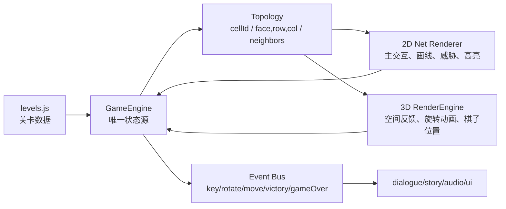

# 🎬 Milestone 4: 3D Direct Interaction & UI Refactoring (2026-06-24 重组主线)

> 状态：`[PLAN_APPROVED]`  
> 执行者：Codex  
> 红线：不使用任何 2D Net 展开图逻辑（彻底废弃 2D Net 画线，仅保留 3D 界面画线与 Twist 层）；保持极致的 UI 微动效与毛玻璃美学；不使用占位美术。

- [ ] **M4.1 页面布局与正常模式控制重构 (UI & Normal Mode Controls)**
  - [ ] 彻底移除左侧面板 `left-panel` 极其样式。
  - [ ] 实现顶部极简 HUD 栏：显示关卡名称、当前回合数、剩余行动点 (AP)。
  - [ ] 实现 **正常模式分流 (Normal Mode Controls)**：
    - 鼠标左键点击格子（`moved <= 10px`）：追加路径。
    - 鼠标左键拖拽（`moved > 10px`）：直接转动相机视角（OrbitControls 保持 enabled，对魔方与空白处拖拽均生效）。
  - [ ] 实现 **Esc 全屏模糊控制台 (Esc Menu)**：
    - 按 `Escape` 键或点击顶部 `☰` 按钮触发，背景应用 `backdrop-filter: blur(10px)`。
    - 左侧显示关卡介绍、任务目标与星级回合挑战清单（根据 A* Bot 结果动态定义三星/二星回合线）。
    - 右侧显示控制按钮（继续游戏、重新开始、声音开关、返回菜单）和生存数据统计（信任值、已用旋转数等）。
  - [ ] 重构右侧 E-7 手机面板：
    - 增加左侧边缘的 Notch 拉手（`◀` / `▶`），点击可优雅向右隐藏或滑出。
    - 仅保留「通讯（Comms）」与「档案（Archive）」两个 Tab（删除展开图和任务 Tab）。
    - 档案页中将 Achievements (成就) 移到 Story (剧情碎片) 上方。

- [ ] **M4.2 3D 空间直控与画线规划 (3D Cube Interaction)**
  - [ ] 废弃 2D Canvas（minimapCanvas）事件，直接在 3D Canvas 上进行交互。
  - [ ] **射线点击判定修复 (Raycasting Fix)**：
    - 在 `pickBoardCell` 中，过滤 intersections，只取第一个类型为 `Mesh`、具有 `face` 面数据且不是 `layerOverlay` 遮罩的相交对象，忽略 LineSegments 边缘线和高亮覆盖层。
  - [ ] **旋转后坐标映射修复 (Post-Rotation Alignment)**：
    - 废弃依赖静态 `userData` 映射。通过 `face.normal.applyQuaternion(cublet.quaternion)` 计算世界空间法线确定物理面 $F$。
    - 根据 cublet 的 3D 世界坐标反推当前网格坐标 $(gx, gy, gz)$，并映射到面内行列 $(r, c)$ 获取正确 Cell ID。
  - [ ] **Twist 旋转模式与自然拖动映射 (Natural Swipe-to-Twist)**：
    - 绑定 Shift 键（或 E-7 手机上的切换悬浮按钮）开启/关闭。
    - 开启时：悬浮高亮整层霓虹光晕；在魔方上左键拖动时**禁用 OrbitControls**，松开时恢复。
    - 拧动计算：将屏幕拖动向量投影到相机坐标并映射到切平面 `swipePlane`，计算得到垂直的旋转轴、旋转层及 CW/CCW 方向。每次旋转消耗 1 AP (原为 2 AP)。
  - [ ] **画线规划模式与代数反馈**：
    - 关闭 Twist 模式时，画线规划路径每段中点生成指向下一个单元格的锥形箭头。
    - 画线时在 comms 输入框实时生成代数格式的指令（例如 `走向：绿b2 -> 绿a2`）。
    - 确认路径按钮改在 Comms 聊天框底部，点击以“发送”气泡形式发出路径指令。

- [ ] **M4.3 E-7 信任值与理智逆反系统 (Trust & Obedience System)**
  - [ ] 引入持久化的关系信任值 (0-100，保存在 `localStorage`，初始默认 80)。
  - [ ] 动态交互影响：通关成功 +3 信任，死亡 -10 信任。发关心表情 +1 信任，发挑衅/吐槽表情 -2 信任。
  - [ ] 逆反判定：不听话概率为 `(100 - 信任值) * 0.3`。
  - [ ] 理智逆反执行：发生逆反时中断路径，消耗 1 AP。50% 概率原地不动，50% 概率随机乱走一格。乱走时**只能选择非缺口、无怪物、安全的相邻格子**，如无安全格则原地不动。

- [ ] **M4.4 细节抛光与体验优化 (Polish & Game Feel)**
  - [ ] **视角重置**：切换/重置关卡时自动将 Three.js 相机复位至默认角度。
  - [ ] **平移手势**：统一触控板双指与鼠标右键拖拽的平移逻辑，防止冲突。
  - [ ] **角色与门**：调低出口门发光亮度防止过曝；提高 E-7 主角棋子自身的对比度与亮度。
  - [ ] **结算延迟**：获胜/失败弹窗必须等待 3D 行走动画播放结束后才弹出。
  - [ ] **狂暴警告**：守钥者被激活后颜色变红（原本是淡黄色），并提示 `rage` 狂暴。
  - [ ] **残局复盘分析**：玩家死亡后，失败分析界面会对比玩家路线中每一步，指出哪些步骤是“离怪物更近了一步”的致命动作。
  - [ ] **学术报告 AI 声明**：在 `project_pitch_report.md` 尾部追加 AI Statement。

---

# 🌙 Night Autonomous Roadmap Round 3 (2026-06-12 长夜主线)

> 状态：`[MILESTONE_2_DELIVERED_WAITING_QA]`  
> 执行者：Codex  
> 红线：不新增未批准的大机制；不靠文档灌水；核心实装、关卡重构、自动化验证、真实视觉检查占主要工作量。

## Milestone 1: 质量门槛升级与短关定位
- [x] R3-M1.1 重新物理扫描目录、Git 状态、最近提交、`package.json`、`task.md`、`COMMUNICATION_BOARD.md`、`CLAUDE.md` 与 `agents_hub/todo_list.md`。
- [x] R3-M1.2 升级 `tools/quality-audit.js`：增加可配置的最小回合/机制密度门槛，输出 `severity` 与“建议处理动作”，避免只给模糊 warning。
- [x] R3-M1.3 新增 `tools/level-difficulty-report.js`：统计 L01-L40 的回合曲线、机制首次出现、短关簇、连续同机制疲劳点。
- [x] R3-M1.4 将质量门槛接入 `package.json`：新增 `audit:quality:strict` 与 `report:difficulty`，用于夜间无人值守持续检查。

## Milestone 2: 第二幕短关重构，减少“按钮流程感”
- [x] R3-M2.1 优先重构 L21/L26/L28/L34/L37：保留教学意图，但让正解至少形成“判断 + 执行”两段，而非点一次工具直通。
- [x] R3-M2.2 审查 L13/L20/L22/L31/L35：L20 已拉到 8 回合；L13/L22/L31/L35 保留为质量审计 warning，建议作为节奏过渡或下一轮精修对象，不再伪装成已解决。
- [x] R3-M2.3 每改一批关卡，运行 `npm run audit:levels`、`npm run playtest`、`npm run audit:quality`，连续三次同错则写入 `failure_log.json` 并跳过该关。
- [x] R3-M2.4 更新 `walkthrough.md` 与 `level_quality_report.md`，让报告反映最新关卡，而不是上一轮快照。

### Milestone 2 Delivery Evidence (Codex, 2026-06-12)

- L04 从旧的无解/求解器失败状态修复为可解且必须旋转；`node tools/validate-levels.js "L04|L05"` 通过。
- L13 移除误放的补片教学属性，恢复为第二幕四阶外壳开场，避免“新机制提前泄漏”。
- L21/L26/L28/L34/L37 已重构或加长：补片/传送门不再只是点一下直通，Bot 路线分别形成 6-7 回合左右的判断链。
- `npm run check`、`npm run audit:design`、`npm run audit:levels`、`npm run playtest`、`npm run audit:quality` 均通过硬门槛。
- 剩余真实风险：`npm run audit:quality` 仍报告 L13/L22/L31/L35 为第二幕无工具短关 warning；`difficulty_report.md` 还显示 L31-L33 短关簇。建议由 Mastermind 决定它们是保留为呼吸节奏，还是进入下一轮关卡重写。

## Milestone 3: 新手可读性、手感与视觉冒烟
- [ ] R3-M3.1 增强失败/成功/关键道具事件的 E-7 微反应触发检查，保证拿钥匙、传送、补片碎裂、诱饵触发都有可感知反馈。
- [ ] R3-M3.2 增加轻量静态 UI 审计脚本：扫描 `transition: all`、原生 `ease`、过长按钮文案和重复教学标签。
- [ ] R3-M3.3 尝试真实浏览器/本地静态服务视觉冒烟；若 Playwright 不可用，则使用现有 Browser/Chrome 能力或记录 SKIPPED 原因。
- [ ] R3-M3.4 生成最终 `handover_report.md`：保留异常与降级大屏、测试命令、剩余人工试玩关卡 Top 3。

---

# 🌙 Night Autonomous Roadmap Round 2 (2026-06-12 深夜续航)

> 状态：`[COMPLETED]`  
> 执行者：Codex  
> 续航原则：不重复上一轮已完成项；核心代码/关卡/测试实装占比高于 70%；文档只作为机器输出和晨间交接，不做灌水。

## Milestone 1: 求解器产品化与关卡质量基线
- [x] R2-M1.1 重新扫描项目与状态板，确认 Round 1 已完成但历史 M3 walkthrough/质量审计仍未真正交付。
- [x] R2-M1.2 升级 `tools/playtest_bot.js`：增加 `--summary`、`--json`、`--markdown` 输出模式，避免只能刷屏看 ANSI 图。
- [x] R2-M1.3 新增/升级关卡质量审计入口：自动统计每关 Bot 回合数、是否使用核心机制、工具收益、敌人压力、过短关风险。
- [x] R2-M1.4 生成 `walkthrough.md`：覆盖 L01-L40，每关给出解法动作、机制标签、设计风险，不写空泛文案。
- [x] R2-M1.5 将求解器和审计入口接入 `package.json` scripts，形成可重复命令，而不是临时命令碎片。

## Milestone 2: 第二幕过短关与“像流程不似残局”修复
- [x] R2-M2.1 用新审计器筛出 L13-L40 中回合数过短、关键机制缺席、可无脑直走的关卡。
- [x] R2-M2.2 优先重构 L16/L28/L30/L34/L40 等传送门过短关：增加追击压力或地形限制，让传送门成为判断而不是捷径按钮。
- [x] R2-M2.3 对 L13-L20 的第二幕开场坡度做再审查：保留四阶空间感，但避免“只是三阶放大版”；L13/L20 仍作为后续重排警告保留。
- [x] R2-M2.4 每次关卡重构后运行目标验证和 Bot 解，若 1000 次约束仍失败则标记 `[DEGRADED]` 并记录 `failure_log.json`。

## Milestone 3: 手感验证、音频反馈与晨间稳定交接
- [x] R2-M3.1 审查 `audio.js` 与主流程事件，补齐传送门、补片碎裂、诱饵触发、胜利/失败的差异化合成 SFX 调用。
- [x] R2-M3.2 增加轻量级 JS/CSS 手感检查：确认关键按钮、终端 tab、路线执行反馈都使用明确属性贝塞尔转场。
- [x] R2-M3.3 运行 `node --check`、设计审计、完整 40 关验证、Bot summary、walkthrough 生成测试。
- [x] R2-M3.4 更新 `handover_report.md`，保留异常与降级大屏，并列出主人醒来后需要人工试玩的最小关卡集。

---

# 🌙 Night Autonomous Roadmap (2026-06-12)

> 状态：`[COMPLETED]`  
> 执行者：Codex  
> 守则：核心代码/关卡/测试实装占比必须高于 70%；文档与整理不超过 10%；每完成一个子任务就更新本文件作为心跳。

## Milestone 1: 第二幕工具关硬约束与关卡质量修复
- [x] M1.1 重新同步 `COMMUNICATION_BOARD.md` / `agents_hub/CODEX_BOARD.md` / `task.md` 状态，避免根看板仍停在旧状态。
- [x] M1.2 修复 L23、L27、L29、L33 的旋转绕过漏洞：关闭这些工具验证关的 `rotationEnabled`，让诱饵/补片必须因为局面需要而被使用。
- [x] M1.3 重构 L29 `voidCells` 与孤岛地形，使“不用补片”确实无法完成，而不是规则上强迫玩家使用。
- [x] M1.4 重构 L32 门端压力：关闭旋转绕过后，传送门路线需先用诱饵节省关键节奏。
- [x] M1.5 补齐 L23/L27/L29/L32/L33/L34 的 `minBeaconTurnGain`、`minPatchTurnGain`、`minBridgeTurnGain` 等验证门槛；L24 重定为组合小考，不作为单工具硬阈值关。
- [x] M1.6 运行目标关卡验证，若同一关连续三次失败且无法修复，写入 `failure_log.json` 并标记 `[Blocked]`。

## Milestone 2: A* Playtest Bot 与强力关卡审计
- [x] M2.1 新建 `tools/playtest_bot.js`，用 `vm` 加载 `levels.js` / `game.js`，建立可复用的关卡状态搜索入口。
- [x] M2.2 实装 A* / Dijkstra 混合求解：支持移动、取钥匙、进门、敌人回合推进，并加入距离敌人 <= 2 的高额危险惩罚。
- [x] M2.3 输出 ANSI 2D Net 黄金路线图，标记 `P/K/E/C/G/*`，方便玩家/设计师肉眼看解法是否有趣。
- [x] M2.4 在死局、搜索熔断、无解时写入 `failure_log.json`，记录关卡 ID、尝试动作、堆栈和失败状态。
- [x] M2.5 用 Bot 跑 L01-L12、L23/L24/L27/L29/L32/L33/L34，确认“工具真实有用”而不是“系统要求你点一下”。

## Milestone 3: UI 流式美学、手感与晨间交接
- [x] M3.1 在 `index.html` 引入 `Noto Sans SC`、`Oxanium`、`Orbitron`、`Inter`，并在 `style.css` 建立字体层级。
- [x] M3.2 将 `#game-container` 固定侧栏和核心按钮 padding 改为 `clamp()` 流式布局，降低不同屏幕下的挤压感。
- [x] M3.3 升级 `.glass-panel` AO 阴影、青蓝微光与明确属性转场，避免廉价塑料感和 `transition: all` 回潮。
- [x] M3.4 修复/降级 `tools/browser-smoke.js` 的 Playwright 依赖缺口：无依赖时明确跳过并提示安装，而不是堆栈崩溃。
- [x] M3.5 运行最终静态语法检查、关卡审计、目标求解器验证。
- [x] M3.6 生成 `handover_report.md`，开头必须包含“异常与降级大屏”，并列出醒来后人工介入前三项。

---

# 📋 escape Project Development Checklist

## Milestone 0: 技术栈自检与方案探讨 (Alignment & Planning)
- `[x]` 扫描项目目录，自检依赖与构建测试环境。
- `[x]` 探讨并设计“10关卡渐进式心流与难度斜率曲线表”，并在 `COMMUNICATION_BOARD.md` 中提交审核。
- `[x]` 设计 E-7 的第一幕对话脚本与颜文字互动匹配表，提交审核。
- `[x]` 规划 3D 立方体与 2D Net 展开图的渲染桥接架构，设计数据流。

## Milestone 1: 核心画线与双棋盘机制实装 (Core Gameplay Loop)
- `[x]` 绘制 2D Net 展开图，实现格线绘制、自动格子吸附与跨面移动算法。
- `[x]` 使用 WebGL 或 Canvas 绘制 3D 辅助立方体，与 2D 展开图实现实时状态同步旋转与高亮。
- `[x]` 实装 Hunter 移动算法、危险警告格红色提前公开高亮。
- `[x]` 实装 Key Keeper 守护、钥匙提取判定、狂暴追踪算法。
- `[x]` 限制行动力 (AP) 扣减，旋转立方体层扣减 2 AP。

### Milestone 1 Completion Evidence (Codex, 2026-06-11)

- 2D Net：`game.js` 已通过 `drawMinimap()`, `getCellFromMinimapEvent()`, `handleMinimapPointer()` 实现展开图绘制、鼠标/触摸格子吸附、拖拽画路与跨面邻接校验。
- 3D Cube：`render.js` 已通过 `RenderEngine` / Three.js 实现 3D 立方体、棋子、钥匙、门、传送门、层旋转动画与 `highlightLayer()` 高亮；2D/3D 均读取 `GameEngine` 单一状态源。
- Hunter：`game.js` 已通过 `computeAIMovement()`, `previewAIMovement()`, `getThreatCells()` 公开下一轮危险格。
- Key Keeper：`game.js` 已通过 `getAITarget()`, `getAIStepBudget()`, `checkKeyCollection()` 支持未取钥 1 格引诱、取钥后 2 格狂暴或守门；AI 禁止站钥匙/门。
- AP：`executePlannedPath()` 按步扣 AP；`rotateLayer()` 明确要求并扣减 2 AP。
- 关卡修正：L02-L05、L09 的 3x3 中心钥匙已移到边缘，避免再次出现“吃钥匙后无解/误解”的老问题。
- 验证结果：`node --check game.js main.js render.js levels.js dialogue.js story.js audio.js` 全通过；`node tools/validate-levels.js "L0[1-9]|L10"` 通过；40 关摘要验证：`unsolved=[]`, `enemyOnKey=[]`, `enemyOnExit=[]`, `keyAtFaceCenter3x3=[]`, `bridgeInvalid=[]`。

## Milestone 2: 叙事、终端聊天与美学抛光 (Narrative & Aesthetics)
- `[x]` 编写 Operator 终端界面，允许玩家仅发送颜文字，E-7 实时做出黑色幽默回应。
- `[x]` 接入 Remotion 级别的 UI 动效：
  - 卡片和选项卡入场加入 `calc(var(--i) * 50ms)` 递增延迟。
  - 按钮悬浮与立方体旋转使用 `cubic-bezier(0.34, 1.56, 0.64, 1)` 回弹或 `cubic-bezier(0.16, 1, 0.3, 1)` 急速停靠。
  - 棋盘使用高端毛玻璃和多层 AO 环境阴影。
- `[x]` 基于 Web Audio API 合成点击、移动、解开钥匙、被追猎者击杀的动态音效。

### Milestone 2 Completion Evidence (Codex, 2026-06-11)

- Operator 终端：`index.html` 右侧手机已统一为 `E-7 PHONE`，通讯区只暴露颜文字按钮；`main.js` 的 `showDialogueScene()`, `chooseCommsReply()`, `pushMicroReaction()` 支持 E-7 黑色幽默回应、事件反应和未读红点。
- 叙事状态：`dialogue.js` / `story.js` 维护章节场景、关键事件、关系语气和微反应；无正式头像前继续使用信号/气泡，不塞廉价占位头像。
- UI 动效：`style.css` 已加入 `--ease-decisive`, `--ease-natural`, `--ease-elastic`，并移除玩家界面 CSS 中的 `transition: all` 与原生 `ease` transition。
- Web Audio：`audio.js` 使用 Web Audio API 合成 UI、路线、移动、钥匙、旋转、追击、失败等反馈，并保留声音开关。
- 验证结果：`node --check game.js main.js render.js levels.js dialogue.js story.js audio.js` 全通过；`node tools/audit-level-design.js` 无硬错误；前 10 关摘要验证 `unsolved=[]`, `enemyOnKey=[]`, `enemyOnExit=[]`, `keyAtFaceCenter3x3=[]`。
- 边界说明：`assets/e7_avatar.png` 与 `assets/ambient_bgm.mp3` 仍等待资产区交付；当前没有用廉价临时头像或未授权 BGM 替代。

## Milestone 3: 自动化测试与交付与关卡高质重构 (QA, Level Audit & Deliverables)
- `[ ]` 编写 `tools/playtest_bot.js`：实现 BFS/Dijkstra 路径求解算法，精准输出关卡的最短通关路径和步数。
- `[ ]` 编写关卡设计审计与修正脚本：自动遍历现有的 40 关（在 `levels.js` 中）。
  - 对最短通关步数进行下限约束：前 3 关 $\ge 3$ 步，4-10 关 $\ge 5$ 步，11-20 关 $\ge 8$ 步。
  - **强锁旋转机制**：第 5 关及以后，必须强制发生至少 1 次层旋转动作，否则连线不能到达终点门。
  - 对于步数或旋转机制不达标的关卡，自动尝试通过调整元素位置或增加旋转门线来重构关卡。
- `[ ]` 实装自动降级（Degradation）与标记逻辑：
  - 若关卡重构尝试 1000 次仍无解，允许自动降低步数要求（例如将 8 步最少限制降低到 6 步），但在 `levels.js` 的关卡数据中将属性 `degraded: true`，并在根目录生成 `failure_log.json` 详细记录降级数据。
- `[ ]` 运行自动求解测试：输出所有 40 关的 ASCII 通关黄金路线解说图。
- `[ ]` 联审委员会评审，生成最终的 `walkthrough.md` 交付报告。

---

# Codex Implementation Plan v0.1 `[PLAN_APPROVED_AND_M2_IMPLEMENTED]`

> 提交人：Codex  
> 提交原因：Mastermind 要求读取 `DESIGN_BRIEF.md` 后，在本文件写入详细实施计划。  
> 重要同步：`COMMUNICATION_BOARD.md` 当前锁定主角名为 **E-7**；历史代码/文档中曾存在旧主角名。执行阶段已统一以 E-7 为主，除审查记录外不再使用旧名。

## 0. 技术栈与现状自检

| 项目 | 结论 |
| :--- | :--- |
| 技术栈 | Vanilla HTML/CSS/JS；无构建命令；可直接浏览器运行。 |
| 当前核心文件 | `index.html`, `style.css`, `game.js`, `render.js`, `main.js`, `levels.js`, `dialogue.js`, `story.js`, `audio.js`。 |
| 当前测试工具 | `tools/validate-levels.js`, `tools/audit-level-design.js` 已存在，可作为关卡可解性与重复度检查基础。 |
| 资产约束 | 不新增廉价占位美术；E-7 头像与 BGM 已在留言板资产区请求。 |
| 主要风险 | 旧文档/代码命名与留言板 E-7 冲突；执行阶段需统一术语，避免 UI 文案分裂。 |

## 1. 10 关渐进式心流与难度斜率曲线表

设计原则：前 10 关不追求“每关塞新东西”，而追求玩家从“相信格子”到“开始下残棋”。每关必须有一个清晰学习收益、一个情绪目标、一个可验证门槛。

| 关卡 | 机制焦点 | 情绪/心流目标 | 难度斜率 | 验证门槛 | 失败后应解释 |
| :--- | :--- | :--- | :--- | :--- | :--- |
| L01 | 手动画线到门；无敌人 | “我能控制路线” | 1/10 | 必须画路；不可自动寻路替代 | 只提示路线未连上。 |
| L02 | 钥匙→门顺序 | “目标顺序很直观” | 1.5/10 | 必须先拿钥匙再进门 | 没钥匙时门不开。 |
| L03 | 单追击者与红色威胁 | “红格可信，不是装饰” | 2.5/10 | 玩家需要避开公开威胁 | 追击者从哪格逼近。 |
| L04 | 首次旋转整层，门随层动 | “世界可被拧开” | 3.5/10 | 无旋转不可通或明显亏 | 不拧时门线被压死。 |
| L05 | 钥匙也随层转 | “目标不是固定物” | 4/10 | 旋转钥匙进入路线 | 目标随层移动的可视反馈。 |
| L06 | 守钥者首次引诱 1 格 | “敌人可被调动” | 4.5/10 | 守钥者不踩钥匙；进入钥匙面会追 | 为什么它离开守位。 |
| L07 | 旋转拆开守钥者/钥匙 | “先改局面再取物” | 5/10 | 必须利用旋转或等价拆位 | 直接取钥为何被堵。 |
| L08 | 取钥后守钥者 2 格狂暴 | “拿到钥匙才是真开始逃” | 5.5/10 | 守钥者 pre=1, post=2；钥匙不在 3x3 中心 | 拿钥匙后距离如何被拉近。 |
| L09 | 第一幕无新规则实战 | “学过的东西终于用上了” | 6/10 | 无开局空过；追击压力真实 | 哪条红线压缩了路线。 |
| L10 | 追击 + 守钥 + 旋转拆位真题 | “开始像残局，不像教程” | 6.5/10 | 与 L04 解法指纹不同；无重复教学 | 旋转/引诱哪个节拍错了。 |

大神视角自审：这 10 关必须避免“上课感过强”。L01-L08 是规则建立，L09-L10 必须给玩家第一次组合拳满足感，否则玩家会觉得学了半天没处使。

## 2. E-7 第一幕对话脚本与颜文字互动匹配表

声音基准：E-7 是嘴硬、害怕但强撑、会吐槽的被困者。她不是教程播报员。玩家只能发颜文字，E-7 负责完整文本回应。

| 节点 | E-7 初始气泡 | 玩家颜文字 | E-7 回复方向 |
| :--- | :--- | :--- | :--- |
| 序章 01 | “我刚才在床上。现在脚下是一个会转的魔方。你是谁？” | `(⊙_⊙)` | “很好，你也不知道。这个回答很糟，但至少诚实。” |
| 序章 02 | “那条线是你画的？我不认识你。” | `(｀・ω・´)` | “别摆出可靠的样子。你现在只是可疑但暂时有用。” |
| L01 起步 | “你画短一点。我先确认你不会害死我。” | `(・∀・)b` | “别点得这么理所当然。先走，活下来再评价你。” |
| 首次红格 | “红色不是气氛灯。它要踩那里。” | `(・_・;)` | “紧张可以，线别抖到红格里。” |
| 首次旋转 | “停，刚才不是我走了，是整个世界被你拧了。” | `(⊙_⊙)` | “你也吓到了？很好，我不是唯一一个想投诉物理的人。” |
| 首次守钥者 | “那个东西没站钥匙上，但它很明显不想让我靠近。” | `(ง •̀_•́)ง` | “好，有斗志。别把斗志画进它脸上。” |
| 首次失败 | “刚才那段我们可以假装没发生。” | `(´･ω･)` | “别那副表情。我还在。大概。再来，但认真点。” |
| L12 结尾 | “门开了。坏消息：外面还有一个更大的魔方。” | `(⊙_⊙)` | “对，就是这个表情。我也不喜欢‘更大的魔方’这几个字。” |

执行规则：
- 对话不改变谜题难度，只改变语气记忆、档案解锁和章节文本。
- 每次关键机制首次出现，只给 1-3 句人话，不写系统说明。
- 无正式头像前，通讯位保持信号框/气泡，不使用廉价头像占位。

## 3. 3D 立方体与 2D Net 渲染桥接架构

核心原则：2D Net 是主棋盘，3D Cube 是空间反馈。玩家决策不能依赖反复在两个主视角之间猜。



数据流细则：
- 所有格子统一用 `cellId` 做身份，不用屏幕坐标当逻辑来源。
- `GameEngine` 维护玩家、钥匙、门、敌人、传送门、缺口、补片、诱饵、旋转状态。
- 2D Net 点击/拖拽只提交目标 `cellId`；合法性由 `GameEngine.getNeighbors()` 与 AP 判断。
- 3D Cube 只读取状态并播放动画；动画完成后不得产生独立逻辑分叉。
- Hover/选中/路线末端高亮必须 2D/3D 双向同步，但 2D 优先显示完整决策信息。

## 4. UI 贝塞尔动效实装细则

全局 CSS Token 提案：

```css
:root {
  --ease-decisive: cubic-bezier(0.16, 1, 0.3, 1);
  --ease-natural: cubic-bezier(0.4, 0, 0.2, 1);
  --ease-elastic: cubic-bezier(0.34, 1.56, 0.64, 1);
  --stagger-step: 50ms;
}
```

动效映射：
- 关卡卡片入场：`opacity, transform`，延迟 `calc(var(--i) * var(--stagger-step))`。
- 终端 Tab 切换：`transform` + `opacity`，使用 `--ease-decisive`，避免拖泥带水。
- 按钮 hover/press：只动画 `transform`, `box-shadow`, `opacity`，按钮回弹用 `--ease-elastic`。
- 旋转控件与层高亮：确认瞬间用 `--ease-decisive`，悬浮预览用 `--ease-natural`。
- 禁止：`transition: all 0.3s ease`、大面积无意义闪烁、遮挡棋盘的过度转场。

响应式与玻璃规范：
- 字体与间距使用 `clamp()`，不新增硬编码大像素布局。
- 玻璃层使用 `backdrop-filter: blur(20px) saturate(190%)`，配合内发光与多层 AO 阴影。
- 关卡信息卡减少文字；敌人/机制用图标 token 表达，详细概念只在谜面区出现。

## 5. 测试方案与三振熔断策略

基础检查：
- `node --check game.js main.js render.js levels.js dialogue.js story.js audio.js`
- `node tools/audit-level-design.js`
- `node tools/validate-levels.js "L01|...|L10"` 用于前 10 关核心验证。

Playtest Bot 计划：
- 新增 `tools/playtest_bot.js`，读取 `levels.js` 与 `GameEngine`。
- 使用 A* Heuristic：目标阶段 1 先接近钥匙，阶段 2 接近门；启发式基于拓扑最短路而不是平面曼哈顿，避免跨面误判。
- 输出内容：
  - 每关是否可解。
  - 黄金路线动作列表。
  - ASCII Net 路线解说图。
  - 死局或搜索熔断写入 `failure_log.json`。
- 三振熔断：
  - 同一关同一错误连续 3 次，将任务标记 `[Blocked]`，记录 `failure_log.json`，继续无依赖任务。

视觉 QA：
- 计划审核通过后，若允许浏览器测试，则用本地浏览器检查 1280x720、1440x900、移动窄屏。
- 重点检查：第一屏不溢出、2D Net 可读、3D 魔方不黑屏、旋转层高亮不被激光边框吞掉。

## 6. 100 关成品路线提案草案

此处仅作后续提案，不在未批准前继续物理实装。

| 幕 | 关卡 | 主机制 | 成品要求 |
| :--- | :--- | :--- | :--- |
| 第一幕 | L01-L20 | 3x3 基础残局、追击、旋转、守钥、狂暴 | 完成“相信棋盘”和“第一次组合实战”。 |
| 第二幕 | L21-L40 | 4x4、传送门、缺口、补片、诱饵 | 工具必须真实有用，不靠规则点名。 |
| 第三幕 | L41-L60 | 单向传送门或锚点门二选一 | 只引入一个主新规则，防止认知爆炸。 |
| 第四幕 | L61-L80 | 敌人组合升级、门线封锁、折叠机学习 | 形成中后期残局深度。 |
| 第五幕 | L81-L100 | 规则混合、章节终局、剧情回收 | 100 关中每关有独特设计指纹与验证记录。 |

等待 Mastermind 审查项：
1. 是否批准 E-7 命名覆盖旧主角名？
2. 第三幕主机制选择：单向传送门还是锚点门？
3. 前 10 关心流表是否可作为 Milestone 1 实装/精修依据？
4. 是否允许 Codex 在不新增美术资产的情况下，只改代码动效与布局？
